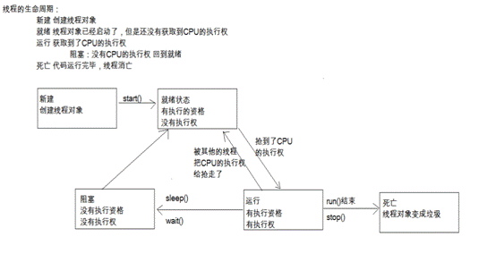

1、在java 中wait和sleep方法的不同？ 
a、sleep方法必须传入参数,参数就是时间,时间到了自动醒来
   wait方法可以传入参数也可以不传入参数,传入参数就是在参数的时间结束后等待,不传入参数就是直接等待；
 b、sleep方法在同步函数或同步代码块中,不释放锁,睡着了也抱着锁睡，wait方法在同步函数或者同步代码块中,释放锁。
 c、wait通常被用于线程间交互 ，sleep通常被用于暂停执行。


2、线程的五种状态。

新建,就绪,运行,阻塞,死亡




3、synchronized和volatile关键字的作用 
   一旦一个共享变量（类的成员变量、类的静态成员变量）被volatile修饰之后，那么就具备了两层语义： 
  (1) 保证了不同线程对这个变量进行操作时的可见性 ，即一个线程修改了某个变量的值 ，这新值对其他线程来说是立即可见的。 
  (2) 禁止进行指令重排序。 
   volatile本质是在告诉jvm 当前变量在寄存器（工作内存）中的值是不确定的，需要从主存中读取； 
      synchronized则是锁定当前变量，只有当前线程可以访问该变量，其他线程被阻塞住。  
```java
 public class Counter { 
     private volatile int count = 0; 
     public void inc(){ 
         try { 
            Thread.sleep(3); 
         } catch (InterruptedException e) { 
            e.printStackTrace(); 
         } 
         count++; 
     } 
     @Override 
     public String toString() { 
         return "[count=" + count + "]"; 
     } 
  } 
  //---------------------------------华丽的分割线----------------------------- 
  public class VolatileTest { 
     public static void main(String[] args) { 
         final Counter counter = new Counter(); 
         for(int i=0;i<1000;i++){ 
            new Thread(new Runnable() { 
                @Override 
                public void run() { 
                   counter.inc(); 
                } 
            }).start(); 
         } 
         System.out.println(counter); 
     } 
  } 
```

 上面的代码执行完后输出的结果确定为1000吗？ 
    答案是不一定，或者不等于 1000。这是为什么吗？ 
    在 java 的内存模型中每一个线程运行时都有一个线程栈，线程栈保存了线程运行时候变量值信息。当线程访问某一个对象值的时候 ，首先通过对象的引用找到对应在堆内存的变量的值 ，然后把堆内存变量的具体值load到线程本地内存中，建立一个变量副本，之后线程就不再和对象在堆内存变量值有任何关系 ，而是直接修改副本变量的值，在修改完之后的某一个时刻（线程退出之前），自动把线程变量副本的值回写到对象在堆中变量。这样在堆中的对象 的值就产生变化了。 
   也就是说上面主函数中开启了 1000个子线程，每个线程都有一个变量副本，每个线程修改变量只是临时修改了自己的副本，当线程结束时再将修改的值写入在主内存中 ，这样就出现了线程安全问题。因此结果就不可能等于1000了，一般都会小于1000。 


4、什么是线程池，如何使用？ 
    线程池就是事先将多个线程对象放到一个容器中 ，当使用的时候就不用new线程而是直接去池中拿线程即可 ，节省了开辟子线程的时间，提高的代码执行效率。
    在JDK的java.util.concurrent.Executors 中提供了生成多种线程池的静态方法：
```java
  ExecutorService newCachedThreadPool = Executors.newCachedThreadPool(); 
  ExecutorService newFixedThreadPool = Executors.newFixedThreadPool(4); 
  ScheduledExecutorService newScheduledThreadPool = 
  Executors.newScheduledThreadPool(4); 
  ExecutorService newSingleThreadExecutor = Executors.newSingleThreadExecutor();
```
然后调用他们的execute方法即可。


5、叙述对线程池的理解(可以展开的说一下线程池如何用、线程池的好处、线程池的启动策略)
(1)、线程池的使用：
    根据JDK提供的静态方法创建线程池，然后调用他们的execute方法即可。
(2)、合理利用线程池能够带来三个好处：
     第一：降低资源消耗。通过重复利用已创建的线程降低线程创建和销毁造成的消耗。 
     第二：提高响应速度。当任务到达时，任务可以不需要等到线程创建就能立即执行。 
     第三：提高线程的可管理性。线程是稀缺资源，如果无限制的创建，不仅会消耗系统资源，还会降低系统的稳定性，使用线程池可以进行统一的分配，调优和监控。
(3)、线程池的启动策略：
    1)、当调用execute() 方法添加一个任务时，线程池会做如下判断： 

        a. 如果正在运行的线程数量小于 corePoolSize ，那么马上创建线程运行这个任务； 
        b. 如果正在运行的线程数量大于或等于 corePoolSize ，那么将这个任务放入队列。 
        c. 如果这时候队列满了，而且正在运行的线程数量小于 maximumPoolSize ，那么还是要创建线程运行这个任务； 
        d. 如果队列满了，而且正在运行的线程数量大于或等于 maximumPoolSize，那么线程池会抛出异常，告诉调用者 “我不能再接受任务了”。 
   3)、当一个线程完成任务时，它会从队列中取下一个任务来执行。 
   4)、当一个线程无事可做，超过一定的时间（keepAliveTime）时，线程池会判断，如果当前运行的线程数大于corePoolSize ，那么这个线程就被停掉。所以线程池的所有任务完成后，它最终会收缩到corePoolSize 的大小。  


6、如何控制某个方法允许并发访问线程的个数。
可以使用Semaphore控制，
```java
public class ThreadTest {
    //信号池，permit信号池中的信号数量，线程必须拿到permit才能继续向下走，否则等待(这里的等待不会阻塞)
    //一个线程取一次permit，permit就减1
    static Semaphore semaphore = new Semaphore(5);//并发访问数是5
    
    public static void main(String[] args) {
        for (int i = 0; i < 30; i++) {
            new Thread(new Runnable() {
                @Override
                public void run() {
                    try {
                        //从信号池中获取一个permit,如果没有获取到就等待，直到拿到permit
                        semaphore.acquire();
                    } catch (InterruptedException e) {
                        e.printStackTrace();
                    }
                    test();
                    //将permit放回信号池中；重载方法release(permit)表示往信号池放任意个信号
                    semaphore.release();
                }
            }).start();
        }
    }
    //TODO 控制方法的线程访问数为5
    public static void test() {
        System.out.println("--thread name--" + Thread.currentThread().getName()
                + "进来了");
        try {
            Thread.sleep(1000);
        } catch (InterruptedException e) {
            e.printStackTrace();
        }
        System.out.println("--thread name--" + Thread.currentThread().getName()
                + "出去了");
    }
}
​
```
 

7、三个线程a、b、c并发运行，b,c需要a线程的数据怎么实现？
有两种方法：
(1)、A线程将count修改为100后，B、C线程再去访问并打印count的值；
创建信号池，信号个数设置为0，这样三个线程运行时，B、C线程会semaphore.acquire()处等待，当A线程执行完semaphore.release()，释放一个信号后，B、C其中一个线程获取信号然后执行。
```java
public class ThreadCommunication {
    static int count = 0;
    static Semaphore semaphore = new Semaphore(0);
 
    public static void main(String[] args) {
        
        //TODO 线程B和C等待线程A的数据
        Thread threadA = new Thread(new Runnable() {
 
            @Override
            public void run() {
                try {
                    Thread.sleep(3000);
                    count = 100;
                    semaphore.release();
                } catch (InterruptedException e) {
                    e.printStackTrace();
                }
 
            }
        });
 
        Thread threadB = new Thread(new Runnable() {
 
            @Override
            public void run() {
                try {
                    semaphore.acquire();
                } catch (InterruptedException e) {
                    e.printStackTrace();
                }
                System.out.println("----threadB--count--" + count);
                semaphore.release();
            }
        });
 
        Thread threadC = new Thread(new Runnable() {
 
            @Override
            public void run() {
                try {
                    semaphore.acquire();
                } catch (InterruptedException e) {
                    e.printStackTrace();
                }
                System.out.println("----threadC--count--" + count);
                semaphore.release();
            }
        });
        threadB.start();
        threadC.start();
        threadA.start();
    }
}
```

(2)、handler实现线程间通讯
B、C线程在loop()方法执行时就阻塞了，当A线程执行完count=100后，给BC线程发送空消息，这时BC线程会执行handMessage(msg)方法。
```java
public class MainActivity extends Activity {
    private Thread threadC;
    private Thread threadB;
    private Thread threadA;
    protected Handler handlerB;
    protected Handler handlerC;
    protected Handler mHandlerB;
    protected Handler mHandlerC;
    private static int count;
    @Override
    protected void onCreate(Bundle savedInstanceState) {
        super.onCreate(savedInstanceState);
        setContentView(R.layout.activity_main);
        //TODO A，B,C线程同时运行，B,C等待A线程
        threadA = new Thread(new Runnable() {
 
            @Override
            public void run() {
                try {
                    Thread.sleep(1000);
                    count = 100;
                    //发消息通知B，C线程
                    mHandlerB.sendEmptyMessage(0);
                    mHandlerC.sendEmptyMessage(0);
                } catch (InterruptedException e) {
                    e.printStackTrace();
                }
 
            }
        });
 
        threadB = new Thread(new Runnable() {
 
            @Override
            public void run() {
                Looper.prepare();
                mHandlerB = new Handler(){
                    public void handleMessage(android.os.Message msg) {
                        System.out.println(Thread.currentThread().getId()+"---threadB---"+count);
                    };
                };
                
                Looper.loop();//阻塞住子线程
            }
        });
 
        threadC = new Thread(new Runnable() {
 
            @Override
            public void run() {
                
                Looper.prepare();
                mHandlerC = new Handler(){
                    public void handleMessage(android.os.Message msg) {
                        System.out.println(Thread.currentThread().getId()+"---threadC---"+count);
                    };
                };
                Looper.loop();//阻塞住子线程
            }
            
        });
    
    }
    public void onClick(View v){
        threadB.start();
        threadC.start();
        threadA.start();
    }
    @Override
    protected void onDestroy() {
        //将线程B，线程C安全退出
        mHandlerB.getLooper().quitSafely();
        mHandlerC.getLooper().quitSafely();
        //mHandlerB.removeCallbacksAndMessages(null);
    }
}
```


