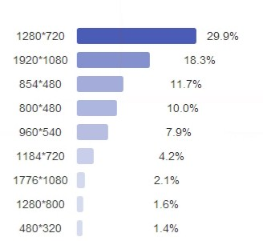
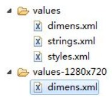
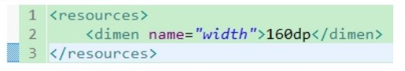
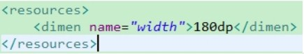
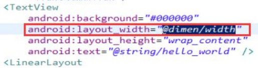

###1、 drawable
Android应用在查找图片资源时会根据其分辨率自动从不同的文件目录下查找（这本身就是Android系统的适配策略），如果在低分辨的文件目录中比如drawable-mdpi中没有图片资源，其他目录中都有，当我们将该应用部署到mdpi分辨率的手机上时，那么该应用会查找分辨率较高目录下的资源文件，如果较高分辨率目录下也没有资源则只好找较低目录中的资源了。 

常见手机屏幕像素及对应分别率级别： 

- ldpi 320*240 
- mdpi 480*320 
- hdpi 800*480 
- xhdpi 1280*720 
- xxhdpi 1920*1080 

dp和px之间的简单换算关系：

- ldpi的手机 1dp=0.75px 
- mdpi的手机 1dp=1.0px 
- hdpi的手机 1dp=1.5px 
- xhdpi的手机 1dp=2.0px 
- xxhdpi的手机 1dp=3.0px 


###2、适配方式之dimens 
    跟drawable 目录类似的，在Android工程的res目录下有values 目录，这个是默认的目录 ，同时为了适配不同尺寸手机我们可以创建一个values-1280x720的文件夹，同时将dimens.xml文件拷贝到该目录下。



在dimens.xml中定义一个尺寸，如下图所示。



在values-1280x720 目录中的dimens.xml中定义同样的尺寸名称，但是使用不同的尺寸，如下图所示。 



当我们在布局文件中使用长或者宽度单位时，比如下图所示，应该使用@dimen/width来灵活的定义宽度。


 
###3 、适配方式之layout 
   跟values一样，在Android工程目录中layout目录也支持类似values 目录一样的适配，在layout中我们可以针对不同手机的分辨率制定不同的布局，如下图所示。 



###4、适配方式之java代码适配 
为了演示用java 代码控制适配的效果，因此假设有这样的需求，让一个TextView控件的宽和高分别为屏幕的宽和高的一半。 
   我们新创建一个Android工程，修改main_activity.xml，布局文件清单如下： 
```xml
<!-- 当前控件宽高为屏幕宽度的各50% --> 
     <TextView 
         android:id="@+id/tv" 
         android:background="#000000" 
         android:layout_width="wrap_content" 
         android:layout_height="wrap_content" 
         android:text="@string/hello_world" /> 
```
在 MainActivity.java类中完成用java 代码控制TextView的布局效果，其代码清单如下： 
```java
 public class MainActivity extends Activity { 
​
​
     private static final String tag = null; 
​
​
     @Override 
     protected void onCreate(Bundle savedInstanceState) { 
        super.onCreate(savedInstanceState); 
        //去掉title 
        requestWindowFeature(Window.FEATURE_NO_TITLE); 
        setContentView(R.layout.activity_main); 
        //获取TextView控件 
        TextView tv = (TextView) findViewById(R.id.tv); 
        //找到当前控件的夫控件(父控件上给当前的子控件去设定一个规则) 
        DisplayMetrics metrics = new DisplayMetrics(); 
        //给当前metrics去设置当前屏幕信息(宽(像素)高(像素)) 
        getWindowManager().getDefaultDisplay().getMetrics(metrics); 
        //获取屏幕的高度和宽度 
        Constant.srceenHeight = metrics.heightPixels; 
        Constant.srceenWidth = metrics.widthPixels; 
        //日志输出屏幕的高度和宽度 
        Log.i(tag, "Constant.srceenHeight = "+Constant.srceenHeight); 
        Log.i(tag, "Constant.srceenWidth = "+Constant.srceenWidth); 
               //宽高各 50% 
        RelativeLayout.LayoutParams layoutParams = new RelativeLayout.LayoutParams( 
               //数学角度上 四舍五入 
               (int)(Constant.srceenWidth*0.5+0.5), 
               (int)(Constant.srceenHeight*0.5+0.5)); 
        //给tv控件设置布局参数 
        tv.setLayoutParams(layoutParams); 
     } 
  } 
```

###5、适配方式之weight权重适配 
在控件中使用属性android:layout_weight="1"可以起到适配效果 ，但是该属性的使用有如下规则： 

- 1、只能用在线性控件中，比如 LinearLayout。 
- 2、竖直方向上使用权重的控件高度必须为0dp （Google官方的推荐用法） 
- 3、水平方向上使用权重的控件宽度必须为0dp （Google官方的推荐用法） 

###6、指定宽高的时候，采用dip的单位，dp单位动态匹配 

###7、由于android代码中写的单位都是像素，所有需要通过工具类进行转化 

###8、尽量使用9-patch图，可以自动的依据图片上面显示的内容被拉伸和收缩。


