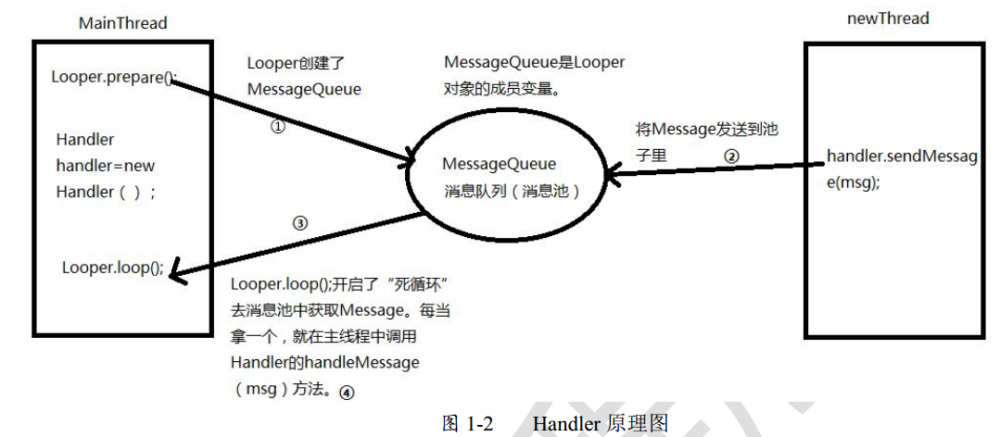
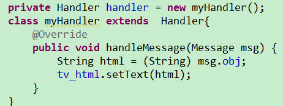
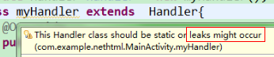
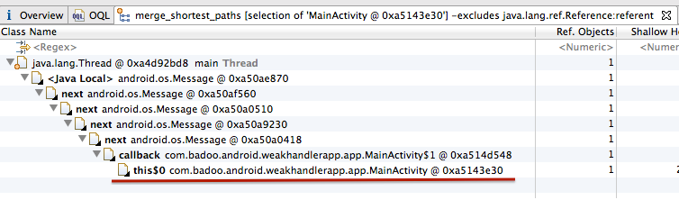

>- Handler消息机制原理
>- Handler内存泄露问题

# 一. Handler消息机制原理

###1、Handler用到的Looper.prepare()、Looper.loop()何时执行的？

    是在应用启动时，ActivityThread.java的main()方法中；ActivityThread.java是系统的一个类，系统启动时运行。

    所以系统启动时，Looper.prepare()、Looper.loop()就开始执行了。

```java
public static void main(String[] args) {
        ...
        Looper.prepareMainLooper();//创建Looper,MessageQueue
        ...
        Looper.loop();//取出消息并处理
    }
```

 在Looper类中，prepareMainLooper()的实现如下：
```java
public static void prepareMainLooper() {
            prepare(false);
            ...
        }
```
 转调prepare()方法：

在prepare方法中创建了一个Looper对象，并将该对象与当前线程(主线程)绑定；
```java
private static void prepare(boolean quitAllowed) {
        ...
        sThreadLocal.set(new Looper(quitAllowed));//创建Looper通过ThreadLocal绑定到主线程中
    }
```

new Looper(quitAllowed)实现如下：

在Looper构造方法中创建了MessageQueue(消息队列)，然后将消息队列赋给Looper的成员变量mQueue；
```java
private Looper(boolean quitAllowed) {
​
​
        mQueue = new MessageQueue(quitAllowed);//创建MessageQueue
​
​
    }
```

###2、Looper.loop()方法的实现
    获取到与当前线程绑定的Looper对象，然后获取到MessageQueue。从MessageQueue取消息。取到消息后，通过Handler.dispatchMessage(msg)处理消息。

    在死循环中通过queue.next()在消息池中取消息。取消息时，如果当前消息池没有消息，那就会发生阻塞，但不会将主线程卡死。涉及到Linux下的管道通讯机制：管道就是内存中的一个特殊的文件，这个文件有两个句柄（其实就是java中的引用），一个是读的句柄，一个是写的句柄；当写的一端写入内容时，读的一端就会被唤醒，读的一端在没有读到消息时会休眠。
```java
public static void loop() {
        final Looper me = myLooper();
       
        final MessageQueue queue = me.mQueue;
​
​
​
​
        for (;;) {//死循环，会不会把主线程卡死？？？
            Message msg = queue.next(); 
            
            msg.target.dispatchMessage(msg);//处理消息，msg.target就是handler
​
​
            msg.recycle();
        }
    }
```
处理消息：
    可以看到，通过handleMessage(msg)方法将msg传递给了我们，因为handleMessage()方法是我们覆写的。
```java
public void dispatchMessage(Message msg) {
      ...
      handleMessage(msg);
}
```

###3、创建Handler时获取到与当前线程绑定的Looper对象，然后获取到MessageQueue，此时Handlder就可以操作消息队列MessageQueue；
```java
public Handler(Callback callback, boolean async) {
            ...
            mLooper = Looper.myLooper();
           
            mQueue = mLooper.mQueue;
            ...
    }


 public static Looper myLooper() {
        return sThreadLocal.get();
    }
```

###4、Handler发送消息，在另一个线程中执行。
handler.sendMessage(msg)具体代码实现：
```java
public final boolean sendMessage(Message msg)
    {
        return sendMessageDelayed(msg, 0);
    }

转调：

public final boolean sendMessageDelayed(Message msg, long delayMillis)
    {
        if (delayMillis < 0) {
            delayMillis = 0;
        }
        return sendMessageAtTime(msg, SystemClock.uptimeMillis() + delayMillis);
    }

转调：

public boolean sendMessageAtTime(Message msg, long uptimeMillis) {
        MessageQueue queue = mQueue;
..............
        return enqueueMessage(queue, msg, uptimeMillis);
    }
```
转调：

queue.enqueueMessage(msg, uptimeMillis);将消息直接放入消息队列中
```java
 private boolean enqueueMessage(MessageQueue queue, Message msg, long uptimeMillis) {
        msg.target = this;
​
​
        return queue.enqueueMessage(msg, uptimeMillis);
    }
```

这四步的顺序是：先执行Loop.prepare()，创建Looper对象和消息队列；再执行Loop.loop()，循环的去消息池中取消息，取到消息时会将消息发给我们；再执行Handler handler = new Handler()使得handler引用到消息队列；最后一步才是handler.sendMessage(msg)，将子线程的消息放到消息池。





# 二. Handler内存泄露问题

##1、  myHandler的黄线问题





提示信息是：Handler类应该被静态，否则可能会发生内存泄露。


##2、为什么会是这样呢？了解一下Handler：
    1、当Android程序第一次创建的时候，在主线程同时会创建一个Looper对象。Looper实现了一个简单的消息队列，一个接着一个处理Message对象。程序框架所有主要的事件（例如：屏幕上的点击时间，Activity生命周期的方法等等）都包含在Message对象中，然后添加到Looper的消息队列中，一个一个处理。主线程的Looper存在整个应用程序的生命周期内。

    2、当一个Handler对象在主线程中创建的时候，它会关联到Looper的 messagequeue 。Message添加到消息队列中的时候，Message会持有当前Handler引用(msg.target)，当Looper处理到当前消息的时候，会调用Handler.handleMessage(Message).

    3、在java中，非静态 的内部类会隐式的持有当前类的一个引用。static的类则没有。

    4、如果你执行了Handler的postDelayed()方法，该方法会将你的Handler装入一个Message，并把这条Message推到MessageQueue中，那么在你设定的delay到达之前，会有一条MessageQueue -> Message -> Handler -> Activity的链，导致你的Activity被持有引用而无法被回收。


##3、使用Handler导致内存泄露的解决方法：

####方法一：通过程序逻辑来进行保护。

1.在关闭Activity的时候停掉你的后台线程。线程停掉了，就相当于切断了Handler和外部连接的线，Activity自然会在合适的时候被回收。

    Handler.getLooper().quitSafely() 将线程安全退出

2.如果你的Handler是被delay的Message持有了引用，那么使用相应的Handler的removeCallbacks()方法，把消息对象从消息队列移除就行了。

####方法二：将Handler声明为静态类。

静态类不持有外部类的对象，所以你的Activity可以随意被回收。代码如下：
```java
static class MyHandler extends Handler {
    @Override
    public void handleMessage(Message msg) {
        mImageView.setImageBitmap(mBitmap);
    }
}
```


但其实没这么简单。使用了以上代码之后，你会发现，由于Handler不再持有外部类对象的引用，导致程序不允许你在Handler中操作Activity中的对象了。所以你需要在Handler中增加一个对Activity的弱引用（WeakReference）：

```java
static class MyHandler extends Handler {
    WeakReference<Activity > mActivityReference;
    MyHandler(Activity activity) {
        mActivityReference= new WeakReference<Activity>(activity);
    }
    @Override
    public void handleMessage(Message msg) {
        final Activity activity = mActivityReference.get();
        if (activity != null) {
            mImageView.setImageBitmap(mBitmap);
        }
    }
}
```

##4、一个内存泄漏的例子：

```java
public class MainActivity extends Activity {
 
    private Handler mHandler = new Handler();
    private TextView mTextView;
    @Override
    protected void onCreate(Bundle savedInstanceState) {
        super.onCreate(savedInstanceState);
        setContentView(R.layout.activity_main);
        mTextView = (TextView) findViewById(R.id.hello_text);
        mHandler.postDelayed(new Runnable() {
            @Override
            public void run() {
                mTextView.setText("Done");
            }
        }, 80000);
    }
}
```

    这是一个基本的activity。在handler的post方法中我们加入了一个匿名的runnable，同时我将其执行延迟了整整80秒。我们运行这个程序，并且旋转几次手机，发现内存有好几个activity,并没有被GC掉。




    从上图中我们可以看到其中一个对mainactivity的引用是来自this$0，this$0是什么呢？以下是关于this$0的解释：static的inner class里面都会有一个this$0的字段保存它的父对象。在Java中，非静态(匿名)内部类会默认隐性引用外部类对象。而静态内部类不会引用外部类对象。

    在我们的代码中，匿名的runnable是一个非静态的内部类，因此他会使用this$0来保存MainActivity，然后runnable会继续被它的callback引用，而callback又接着被接下来一连串的message引用，这样主线程的引用就太他妈多了。 当Activity finish后，延时消息会继续存在主线程消息队列中80秒，然后处理消息，因此handler继续存在于内存中，而handler引用了Activity，在我们旋转手机的时候，Activity不停的重建和finish，导致多个activity的引用出现。

    一旦将Runnable或者是Message 发送进handler，将保存一连串的引用了主线程（这里是MainActivity吧）的Message命令，直到message执行完。如果发送Runnable设置了延迟时间，那么至少在这段延迟时间内内存泄漏是肯定的，如果是直接发送，在Message比较大的情况下，也是有可能发生暂时的泄漏的。

####解决方法一：使用static
```java
public class MainActivity extends Activity {
 
    private Handler mHandler = new Handler();
    private TextView mTextView;
    @Override
    protected void onCreate(Bundle savedInstanceState) {
        super.onCreate(savedInstanceState);
        setContentView(R.layout.activity_main);
        mTextView = (TextView) findViewById(R.id.hello_text);
        mHandler.postDelayed(new DoneRunnable(mTextView), 80000);
    }
    private static final class DoneRunnable implements Runnable{
        private final TextView textView;
        public DoneRunnable(TextView textView){
            this.textView = textView;
        }
        @Override
        public void run() {
            textView.setText("Done");
        }
    }
}
```


在最底下我们发现activity继续被DoneRunnable里面mTextView中的mContext引用着。看来在这种情况下，看来仅仅使用static并没有解决问题啊。还需要做点工作才行。

既然是因为mTextView引起的，那我们把mTextView换成弱引用好了,需要注意的，既然mTextView是弱引用，所以随时都可能为null，因此需要在使用前判断是否为空。
```java
public class MainActivity extends Activity {
 
    private Handler mHandler = new Handler();
    private TextView mTextView;
    @Override
    protected void onCreate(Bundle savedInstanceState) {
        super.onCreate(savedInstanceState);
        setContentView(R.layout.activity_main);
        mTextView = (TextView) findViewById(R.id.hello_text);
        mHandler.postDelayed(new DoneRunnable(mTextView), 80000);
    }
    private static final class DoneRunnable implements Runnable{
        private final WeakReference<TextView> weakReference;
        public DoneRunnable(TextView textView){
            weakReference = new WeakReference<TextView>(textView);
        }
        @Override
        public void run() {
            TextView textView = weakReference.get();
            if (textView != null) {
                textView.setText("Done");
            }
        }
    }
}
```
总结上面的方法：

- 使用静态的内部类
- 对所有handler/Runnable中的变量都用弱引用。

但是这种方式代码很多，而且还必须得小心翼翼。


####解决方法二：在onDestroy中清理掉所有Messages

Handler有个很方便的方法：removeCallbacksAndMessages,当参数为null的时候，可以清除掉所有跟次handler相关的Runnable和Message，我们在onDestroy中调用次方法也就不会发生内存泄漏了。
```java
public class MainActivity extends Activity {
 
    private Handler mHandler = new Handler();
    private TextView mTextView;
    @Override
    protected void onCreate(Bundle savedInstanceState) {
        super.onCreate(savedInstanceState);
        setContentView(R.layout.activity_main);
        mTextView = (TextView) findViewById(R.id.hello_text);
        mHandler.postDelayed(new Runnable() {
            @Override
            public void run() {
                mTextView.setText("Done");
            }
        }, 80000);
    }
    @Override
    protected void onDestroy() {
        super.onDestroy();
        mHandler.removeCallbacksAndMessages(null);
    }
}
```
####解决方法三：WeakHandler


WeakHandler使用起来和handler一模一样，但是他是安全的，你只需要把以前的Handler替换成WeakHandler就行了WeakHandler使用如下：
```java
public class MainActivity extends Activity {
 
    private WeakHandler mHandler = new WeakHandler();
    private TextView mTextView;
    @Override
    protected void onCreate(Bundle savedInstanceState) {
        super.onCreate(savedInstanceState);
        setContentView(R.layout.activity_main);
        mTextView = (TextView) findViewById(R.id.hello_text);
        mHandler.postDelayed(new Runnable() {
            @Override
            public void run() {
                mTextView.setText("Done");
            }
        }, 80000);
    }
    @Override
    protected void onDestroy() {
        super.onDestroy();
        mHandler.removeCallbacksAndMessages(null);
    }
}
```


WeakHandler的实现原理:
WeakHandler的思想是将Handler和Runnable做一次封装，我们使用的是封装后的WeakHandler，但其实真正起到handler作用的是封装的内部，而封装的内部对handler和runnable都是用的弱引用。


原文地址：https://techblog.badoo.com/blog/2014/10/09/calabash-android-query/

github项目地址：https://github.com/badoo/android-weak-handler


