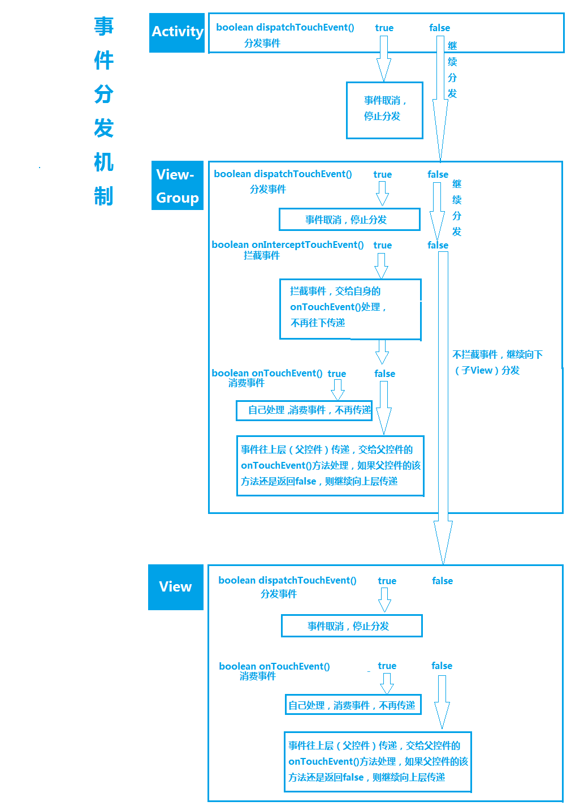
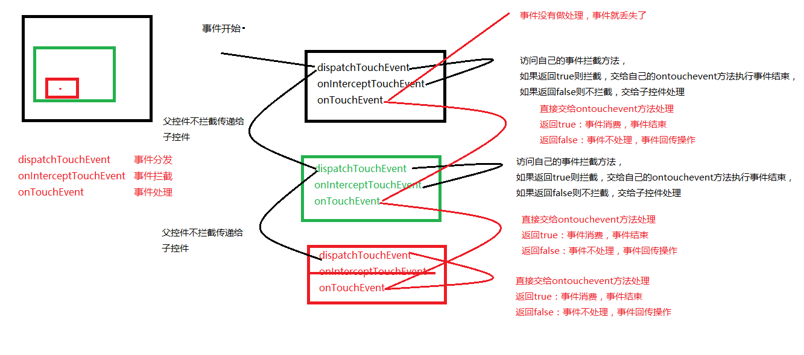

onTouchListener()优先于onTouchEvent()处理事件。

```java
 //事件拦截方法
    @Override
    public boolean onInterceptTouchEvent(MotionEvent ev) {
        //如果是左右滑动的话就直接进行拦截操作
        switch (ev.getAction()) {
        case MotionEvent.ACTION_DOWN:
            //1、获取按下的起始点
            startX = (int) ev.getX();
            break;
        case MotionEvent.ACTION_MOVE:
            //2、获取移动后的结束点
            int endX = (int) ev.getX();
            //3、计算出间距
            int diffX = endX - startX;
            //4、判断间距是否超过一定的像素,如果是则拦截
            if (Math.abs(diffX) > 5) {//如果X轴滑动超过5个像素，则就是左右滑动，进行事件拦截
                return true;
            }
            break;
 
        default:
            break;
        }
        return super.onInterceptTouchEvent(ev);
    }
```

Touch事件的传递过程：

       父容器拿到事件，不拦截，事件就分发给孩子，如果孩子不消费事件，事件又传递给父容器，看父容器是否消费（onTouchEvent）；

       如果ACTION_DOWN事件没有view消费，那么后续的事件ACTION_MOVE,ACTION_UP就不会传递进来；

       父容器拿到事件，不拦截，事件就分发给孩子，如果孩子消费事件，事件传递结束；

       父容器拿到事件，拦截，事件就不会分发给孩子，交给自己处理（onTouchEvent）；

       如果点击的位置没有孩子，事件也不会传递给孩子；        

Activity与事件传递：

    1、Activity获取事件，调用dispatchTouchEvent分发给PhoneWindow

    2、PhoneWindow的DecorView将事件分发给所有的view

    3、没有任何view消费事件，就会调用Activity的touchEvent


