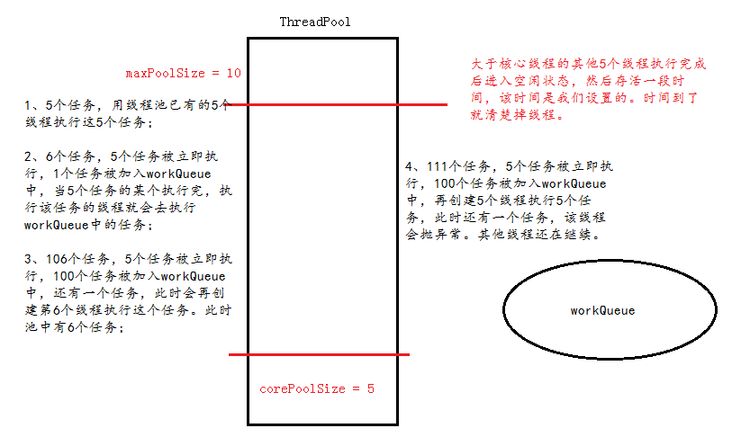

1、原生的线程
```java
    //cachedThreadPool会随着线程的添加而增长
    static ExecutorService cachedThreadPool = Executors.newCachedThreadPool();
    static ExecutorService fixedThreadPool = Executors.newFixedThreadPool(5);
    //singleThreadExecutor只有一个线程
    static ExecutorService singleThreadExecutor = Executors.newSingleThreadExecutor();
```

2、自定义的线程池：

```java
static class MyTreadPool{
        private ThreadPoolExecutor threadPoolExecutor;
​
​
        public MyTreadPool(int corePoolSize, int maximumPoolSize){
            //corePoolSize 核心线程数
            //maximumPoolSize 最大的线程数
            //keepAliveTime 大于corePoolSize线程在空闲状态下存活的时间
            //unit keepAliveTime的单位
            //workQueue 等待队列
            //threadFactory 线程工厂
            BlockingQueue<Runnable> workQueue = new LinkedBlockingQueue<>(100);
            threadPoolExecutor = new ThreadPoolExecutor(corePoolSize, maximumPoolSize, 60L, TimeUnit.SECONDS, workQueue , new ThreadFactory() {
                AtomicInteger count = new AtomicInteger();
                @Override
                public Thread newThread(Runnable r) {
                    Thread t = new Thread(r, "MyTreadPool-thread-"+count.incrementAndGet());
                    return t;
                }
            });
        }
        public void execute(Runnable r){
            threadPoolExecutor.execute(r);
        }   
    }
```

3、线程池的执行原理：



4、
```java
public class ThreadPoolTest {
    //cachedThreadPool会随着线程的添加而增长
    static ExecutorService cachedThreadPool = Executors.newCachedThreadPool();
    static ExecutorService fixedThreadPool = Executors.newFixedThreadPool(5);
    //singleThreadExecutor只有一个线程
    static ExecutorService singleThreadExecutor = Executors.newSingleThreadExecutor();
​
​
    /**
     *  创建线程池
     */
    static class MyTreadPool{
        private ThreadPoolExecutor threadPoolExecutor;
​
​
        public MyTreadPool(int corePoolSize, int maximumPoolSize){
            //corePoolSize 核心线程数
            //maximumPoolSize 最大的线程数
            //keepAliveTime 大于corePoolSize线程在空闲状态下存活的时间
            //unit keepAliveTime的单位
            //workQueue 等待队列
            //threadFactory 线程工厂
            BlockingQueue<Runnable> workQueue = new LinkedBlockingQueue<>(100);
            threadPoolExecutor = new ThreadPoolExecutor(corePoolSize, maximumPoolSize, 60L, TimeUnit.SECONDS, workQueue , new ThreadFactory() {
                AtomicInteger count = new AtomicInteger();
                @Override
                public Thread newThread(Runnable r) {
                    Thread t = new Thread(r, "MyTreadPool-thread-"+count.incrementAndGet());
                    return t;
                }
            });
        }
        public void execute(Runnable r){
            threadPoolExecutor.execute(r);
        }   
    }
​
​
    public static void main(String[] args) {
        MyTreadPool myTreadPool = new MyTreadPool(5, 10);
         
        for (int i = 0; i < 111; i++) {
            myTreadPool.execute(new Runnable() {
                @Override
                public void run() {
                    test();
                }
            });
        }
    }
​
​
    public static void test() {
        String name = Thread.currentThread().getName();
        System.out.println("线程" + name + "进来了");
        try {
            Thread.sleep(2000);
        } catch (InterruptedException e) {
            e.printStackTrace();
        }
        System.out.println("线程" + name + "出来了");
    }
}
```


5、线程池使用案例

```java
public class ThreadPoolManager {


    public ThreadPoolProxy proxy = new ThreadPoolProxy(3, 5, 500);
    private static ThreadPoolManager poolManager;
    public static ThreadPoolManager getInstance() {
        if (poolManager == null) {
            poolManager = new ThreadPoolManager();
        }
        return poolManager;
    }


    //线程池代理类
    public class ThreadPoolProxy {
        private int corePoolSize;
        private int maximumPoolSize;
        private long keepAliveTime;
        private ThreadPoolExecutor threadPoolExecutor;


        public ThreadPoolProxy(int corePoolSize, int maximumPoolSize, int keepAliveTime) {
            this.corePoolSize = corePoolSize;
            this.maximumPoolSize = maximumPoolSize;
            this.keepAliveTime = keepAliveTime;
        }


        public void execute(Runnable runnable) {
            if (threadPoolExecutor == null) {
                threadPoolExecutor = new ThreadPoolExecutor(corePoolSize,//核心的线程数
                        maximumPoolSize, //最大线程数
                        keepAliveTime,//线程空闲的存活时间
                        TimeUnit.MILLISECONDS,//存活时间的单位
                        new LinkedBlockingDeque<Runnable>(),//队列workQueue
                        Executors.defaultThreadFactory());
            }
            //线程池执行任务
            threadPoolExecutor.execute(runnable);
        }
        // 取消下载任务
        public void cancelDownload (Runnable downloadTask) {
            // 如果线程池不为空并且线程池没有被关闭，从线程池的队列中将任务移除
            if (threadPoolExecutor !=null && !threadPoolExecutor.isShutdown()) {
                threadPoolExecutor.getQueue().remove(downloadTask);
            }
        }
    }
}


//使用：
ThreadPoolManager poolManager = ThreadPoolManager.getInstance();
            poolManager.proxy.execute(new Runnable() {
                @Override
                public void run() {
                    
                }
            });
```
