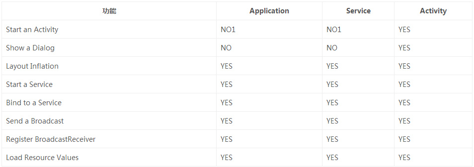

[转载](https://gold.xitu.io/entry/56d64b9e816dfa005943a55c)


#Android中常见的内存泄漏汇总

内存泄漏的根本原因：

堆内存中的长生命周期的对象持有短生命周期对象的强/软引用，尽管短生命周期对象已经不再需要，但是因为长生命周期对象持有它的引用而导致不能被回收，这就是Java中内存泄露的根本原因。

###一、单例造成的内存泄漏

单例模式非常受开发者的喜爱，不过使用的不恰当的话也会造成内存泄漏，由于单例的静态特性使得单例的生命周期和应用的生命周期一样长，这就说明了如果一个对象已经不需要使用了，而单例对象还持有该对象的引用，那么这个对象将不能被正常回收，这就导致了内存泄漏。
如下这个典例：

```java
public class AppManager {

    private static AppManager instance;

    private Context context;
​
    private AppManager(Context context) {

        this.context = context;
    }
​
    public static AppManager getInstance(Context context) {

        if (instance != null) {
            instance = new AppManager(context);
        }
        return instance;
    }
}
```

这样不管传入什么Context最终将使用Application的Context，而单例的生命周期和应用的一样长，这样就防止了内存泄漏

###二、非静态内部类创建静态实例造成的内存泄漏

有的时候我们可能会在启动频繁的Activity中，为了避免重复创建相同的数据资源，可能会出现这种写法：

```java
public class MainActivity extends AppCompatActivity {
​
​
    private static TestResource mResource = null;
​
    @Override
    protected void onCreate(Bundle savedInstanceState) {
        super.onCreate(savedInstanceState);
        setContentView(R.layout.activity_main);

        if(mResource == null){
            mResource = new TestResource();
        }
​
        //...    }
​
    class TestResource {
​
    //...
​
    }
}
```


这样就在Activity内部创建了一个非静态内部类的单例，每次启动Activity时都会使用该单例的数据，这样虽然避免了资源的重复创建，不过这种写法却会造成内存泄漏，因为非静态内部类默认会持有外部类的引用，而又使用了该非静态内部类创建了一个静态的实例，该实例的生命周期和应用的一样长，这就导致了该静态实例一直会持有该Activity的引用，导致Activity的内存资源不能正常回收。

正确的做法为：
将该内部类设为静态内部类或将该内部类抽取出来封装成一个单例，如果需要使用Context，请使用ApplicationContext

###三、Handler造成的内存泄漏

Handler的使用造成的内存泄漏问题应该说最为常见了，平时在处理网络任务或者封装一些请求回调等api都应该会借助Handler来处理，对于Handler的使用代码编写一不规范即有可能造成内存泄漏，如下示例：

```java
public class MainActivity extends AppCompatActivity {
​
private Handler mHandler = new Handler() {
​
    @Override
    public void handleMessage(Message msg) {
    //...

    }
};
​
    @Override
    protected void onCreate(Bundle savedInstanceState) {
        super.onCreate(savedInstanceState);
        setContentView(R.layout.activity_main);
        loadData();
    }
​
    private void loadData(){
​
        //...request
​
        Message message = Message.obtain();
        mHandler.sendMessage(message);
    }
}
```


这种创建Handler的方式会造成内存泄漏，由于mHandler是Handler的非静态匿名内部类的实例，所以它持有外部类Activity的引用，我们知道消息队列是在一个Looper线程中不断轮询处理消息，那么当这个Activity退出时消息队列中还有未处理的消息或者正在处理消息，而消息队列中的Message持有mHandler实例的引用，mHandler又持有Activity的引用，所以导致该Activity的内存资源无法及时回收，引发内存泄漏，所以另外一种做法为：

```java
public class MainActivity extends AppCompatActivity {
​
    private MyHandler mHandler = new MyHandler(this);
    private TextView mTextView ;
​
    private static class MyHandler extends Handler {
​
        private WeakReference<context> reference;
​
        public MyHandler(Context context) {
            reference = new WeakReference<>(context);
        }

        @Override
        public void handleMessage(Message msg) {
​
            MainActivity activity = (MainActivity) reference.get();
            if(activity != null){
                activity.mTextView.setText("");
            }
        }
    }
​
    @Override
    protected void onCreate(Bundle savedInstanceState) {
​
        super.onCreate(savedInstanceState);
        setContentView(R.layout.activity_main);
        mTextView = (TextView)findViewById(R.id.textview);
        loadData();

    }
​
    private void loadData() {
​
        //...request

        Message message = Message.obtain();
        mHandler.sendMessage(message);
    }
}
```


创建一个静态Handler内部类，然后对Handler持有的对象使用弱引用，这样在回收时也可以回收Handler持有的对象，这样虽然避免了Activity泄漏，不过Looper线程的消息队列中还是可能会有待处理的消息，所以我们在Activity的Destroy时或者Stop时应该移除消息队列中的消息，更准确的做法如下：


```java
public class MainActivity extends AppCompatActivity {
​
    private MyHandler mHandler = new MyHandler(this);
    private TextView mTextView ;
​
    private static class MyHandler extends Handler {
​
        private WeakReference<context> reference;

        public MyHandler(Context context) {
            reference = new WeakReference<>(context);
        }
​
        @Override
        public void handleMessage(Message msg) {
            MainActivity activity = (MainActivity) reference.get();
            if(activity != null){
                activity.mTextView.setText("");
            }
        }
    }

    @Override
    protected void onCreate(Bundle savedInstanceState) {

        super.onCreate(savedInstanceState);
        setContentView(R.layout.activity_main);
        mTextView = (TextView)findViewById(R.id.textview);
        loadData();
    }
​
    private void loadData() {
        //...request
​
        Message message = Message.obtain();
        mHandler.sendMessage(message);
​
    }

    @Override
    protected void onDestroy() {
        super.onDestroy();
        mHandler.removeCallbacksAndMessages(null);

    }
}
```


使用mHandler.removeCallbacksAndMessages(null);是移除消息队列中所有消息和所有的Runnable。当然也可以使用mHandler.removeCallbacks();或mHandler.removeMessages();来移除指定的Runnable和Message。

###四、线程造成的内存泄漏

对于线程造成的内存泄漏，也是平时比较常见的，异步任务和Runnable都是一个匿名内部类，因此它们对当前Activity都有一个隐式引用。如果Activity在销毁之前，任务还未完成，
那么将导致Activity的内存资源无法回收，造成内存泄漏。正确的做法还是使用静态内部类的方式，如下：

```java
static class MyAsyncTask extends AsyncTask<void, void,="" void=""> {
​
​
    private WeakReference<context> weakReference;

    public MyAsyncTask(Context context) {
        weakReference = new WeakReference<>(context);
    }
​
    @Override
    protected Void doInBackground(Void... params) {
        SystemClock.sleep(10000);
        return null;
    }

    @Override
    protected void onPostExecute(Void aVoid) {
        super.onPostExecute(aVoid);
        MainActivity activity = (MainActivity) weakReference.get();
​        if (activity != null) {
​
        //...

        }
    }
}
​
​
static class MyRunnable implements Runnable{
​
    @Override
    public void run() {
        SystemClock.sleep(10000);
    }
}
​
//——————
​
new Thread(new MyRunnable()).start();
​
new MyAsyncTask(this).execute();
```


这样就避免了Activity的内存资源泄漏，当然在Activity销毁时候也应该取消相应的任务AsyncTask::cancel()，避免任务在后台执行浪费资源。

###五、资源未关闭造成的内存泄漏

对于使用了BraodcastReceiver，ContentObserver，File，Cursor，Stream，Bitmap等资源的使用，应该在Activity销毁时及时关闭或者注销，否则这些资源将不会被回收，造成内存泄漏。


###六、一些建议

- 对于生命周期比Activity长的对象如果需要应该使用ApplicationContext;

- 对于需要在静态内部类中使用非静态外部成员变量（如：Context、View )，可以在静态内部类中使用弱引用来引用外部类的变量来避免内存泄漏

- 对于不再需要使用的对象，显示的将其赋值为null，比如使用完Bitmap后先调用recycle()，再赋为null

- 保持对对象生命周期的敏感，特别注意单例、静态对象、全局性集合等的生命周期

- 对于生命周期比Activity长的内部类对象，并且内部类中使用了外部类的成员变量，可以这样做避免内存泄漏：

>- 将内部类改为静态内部类
>- 静态内部类中使用弱引用来引用外部类的成员变量

在涉及到Context时先考虑ApplicationContext，当然它并不是万能的，对于有些地方则必须使用Activity的Context，对于Application，Service，Activity三者的Context的应用场景如下：



其中：NO1表示Application和Service可以启动一个Activity，不过需要创建一个新的task任务队列。而对于Dialog而言，只有在Activity中才能创建。