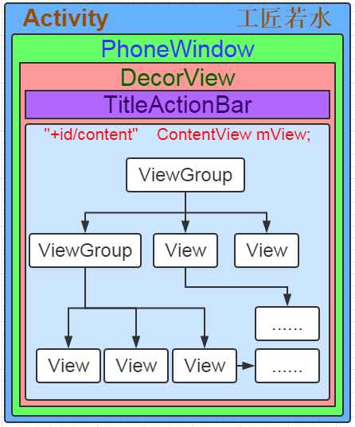
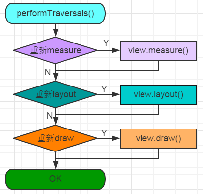
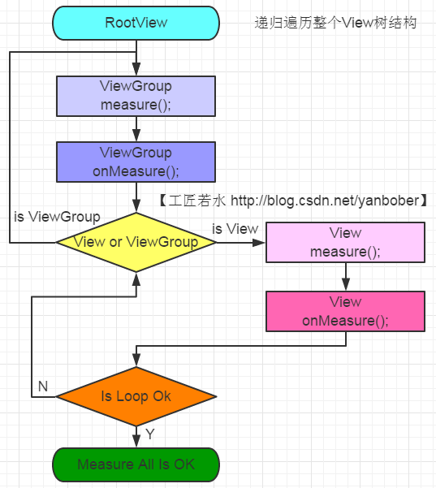

##一、view绘制流程
        


大致流程图：
       整个View树的绘图流程是在ViewRootImpl类的performTraversals()方法（这个方法巨长）开始的，该函数做的执行过程主要是根据之前设置的状态，判断是否重新计算视图大小(measure)、是否重新放置视图的位置(layout)、以及是否重绘 (draw)，其核心也就是通过判断来选择顺序执行这三个方法中的哪个，如下：

```java
private void performTraversals() {
        ......
        //最外层的根视图的widthMeasureSpec和heightMeasureSpec由来
        //lp.width和lp.height在创建ViewGroup实例时等于MATCH_PARENT
        int childWidthMeasureSpec = getRootMeasureSpec(mWidth, lp.width);
        int childHeightMeasureSpec = getRootMeasureSpec(mHeight, lp.height);
        ......
        mView.measure(childWidthMeasureSpec, childHeightMeasureSpec);
        ......
        mView.layout(0, 0, mView.getMeasuredWidth(), mView.getMeasuredHeight());
        ......
        mView.draw(canvas);
        ......
    }
```

```java
private static int getRootMeasureSpec(int windowSize, int rootDimension) {
        int measureSpec;
        switch (rootDimension) {
​
​
        case ViewGroup.LayoutParams.MATCH_PARENT:
            // Window can't resize. Force root view to be windowSize.
            measureSpec = MeasureSpec.makeMeasureSpec(windowSize, MeasureSpec.EXACTLY);
            break;
        ......
        }
        return measureSpec;
    }
```

getRootMeasureSpec()这个方法是用来测RootView的。上面传入参数后这个函数走的是MATCH_PARENT，使用MeasureSpec.makeMeasureSpec方法组装一个MeasureSpec，MeasureSpec的specMode等于EXACTLY，specSize等于windowSize，也就是为何根视图总是全屏的原因。

其中mView就是View对象。大致流程如下：



measure流程：



```java
  //final方法，子类不可重写
    public final void measure(int widthMeasureSpec, int heightMeasureSpec) {
        ......
        //回调onMeasure()方法
        onMeasure(widthMeasureSpec, heightMeasureSpec);
        ......
    }
```

在这里可以看出measure方法最终回调了View的onMeasure方法，我们来看下View的onMeasure源码，如下：

```java
 //View的onMeasure默认实现方法
    protected void onMeasure(int widthMeasureSpec, int heightMeasureSpec) {
        setMeasuredDimension(getDefaultSize(getSuggestedMinimumWidth(), widthMeasureSpec),
                getDefaultSize(getSuggestedMinimumHeight(), heightMeasureSpec));
    }
```

```java
 public static int getDefaultSize(int size, int measureSpec) {
        int result = size;
        //通过MeasureSpec解析获取mode与size
        int specMode = MeasureSpec.getMode(measureSpec);
        int specSize = MeasureSpec.getSize(measureSpec);
​
​
        switch (specMode) {
        case MeasureSpec.UNSPECIFIED:
            result = size;
            break;
        case MeasureSpec.AT_MOST:
        case MeasureSpec.EXACTLY:
            result = specSize;
            break;
        }
        return result;
    }
```

```java
 protected int getSuggestedMinimumWidth() {
        return (mBackground == null) ? mMinWidth : max(mMinWidth, mBackground.getMinimumWidth());
    }
​
​
    protected int getSuggestedMinimumHeight() {
        return (mBackground == null) ? mMinHeight : max(mMinHeight, mBackground.getMinimumHeight());
​
​
    }
```

到此一次最基础的元素View的measure过程就完成了。


上面说了View实际是嵌套的，而且measure是递归传递的，所以每个View都需要measure。实际能够嵌套的View一般都是ViewGroup的子类，所以在ViewGroup中定义了measureChildren, measureChild, measureChildWithMargins方法来对子视图进行测量，measureChildren内部实质只是循环调用measureChild，measureChild和measureChildWithMargins的区别就是是否把margin和padding也作为子视图的大小。如下我们以ViewGroup中稍微复杂的measureChildWithMargins方法来分析：

```java
    /**
     *
     * @param child The child to measure
     * @param parentWidthMeasureSpec The width requirements for this view
     * @param widthUsed Extra space that has been used up by the parent
     *        horizontally (possibly by other children of the parent)
     * @param parentHeightMeasureSpec The height requirements for this view
     * @param heightUsed Extra space that has been used up by the parent
     *        vertically (possibly by other children of the parent)
     */
protected void measureChildWithMargins(View child, int parentWidthMeasureSpec, int widthUsed, int parentHeightMeasureSpec, int heightUsed) { 
​
​
// 子View的LayoutParams，你在xml的layout_width和layout_height,
// layout_xxx的值最后都会封装到这个个LayoutParams。
final MarginLayoutParams lp = (MarginLayoutParams) child.getLayoutParams();   
​
​
//根据父View的测量规格和父View自己的Padding，
//还有子View的Margin和已经用掉的空间大小（widthUsed），就能算出子View的MeasureSpec,具体计算过程看getChildMeasureSpec方法。
final int childWidthMeasureSpec = getChildMeasureSpec(parentWidthMeasureSpec,            
mPaddingLeft + mPaddingRight + lp.leftMargin + lp.rightMargin + widthUsed, lp.width);    
​
​
final int childHeightMeasureSpec = getChildMeasureSpec(parentHeightMeasureSpec,           
mPaddingTop + mPaddingBottom + lp.topMargin + lp.bottomMargin  + heightUsed, lp.height);  
​
​
//通过父View的MeasureSpec和子View的自己LayoutParams的计算，算出子View的MeasureSpec，然后父容器传递给子容器的
// 然后让子View用这个MeasureSpec（一个测量要求，比如不能超过多大）去测量自己，如果子View是ViewGroup 那还会递归往下测量。
child.measure(childWidthMeasureSpec, childHeightMeasureSpec);
​
​
}
```

该方法就是对父视图提供的measureSpec参数结合子View的LayoutParams参数进行了调整，然后再来调用child.measure()方法，具体通过方法getChildMeasureSpec来进行参数调整。所以我们继续看下getChildMeasureSpec方法代码，如下：

```java
// spec参数   表示父View的MeasureSpec 
// padding参数    父View的Padding+子View的Margin，父View的大小减去这些边距，才能精确算出
//               子View的MeasureSpec的size
// childDimension参数  表示该子View内部LayoutParams属性的值（lp.width或者lp.height）
//                    可以是wrap_content、match_parent、一个精确指(an exactly size),  
public static int getChildMeasureSpec(int spec, int padding, int childDimension) {  
    int specMode = MeasureSpec.getMode(spec);  //获得父View的mode  
    int specSize = MeasureSpec.getSize(spec);  //获得父View的大小  
​
​
   //父View的大小-自己的Padding+子View的Margin，得到值才是子View的大小。
    int size = Math.max(0, specSize - padding);   
​
​
    int resultSize = 0;    //初始化值，最后通过这个两个值生成子View的MeasureSpec
    int resultMode = 0;    //初始化值，最后通过这个两个值生成子View的MeasureSpec
​
​
    switch (specMode) {  
    // Parent has imposed an exact size on us  
    //1、父View是EXACTLY的 ！  
    case MeasureSpec.EXACTLY:   
        //1.1、子View的width或height是个精确值 (an exactly size)  
        if (childDimension >= 0) {            
            resultSize = childDimension;         //size为精确值  
            resultMode = MeasureSpec.EXACTLY;    //mode为 EXACTLY 。  
        }   
        //1.2、子View的width或height为 MATCH_PARENT/FILL_PARENT   
        else if (childDimension == LayoutParams.MATCH_PARENT) {  
            // Child wants to be our size. So be it.  
            resultSize = size;                   //size为父视图大小  
            resultMode = MeasureSpec.EXACTLY;    //mode为 EXACTLY 。  
        }   
        //1.3、子View的width或height为 WRAP_CONTENT  
        else if (childDimension == LayoutParams.WRAP_CONTENT) {  
            // Child wants to determine its own size. It can't be  
            // bigger than us.  
            resultSize = size;                   //size为父视图大小  
            resultMode = MeasureSpec.AT_MOST;    //mode为AT_MOST 。  
        }  
        break;  
​
​
    // Parent has imposed a maximum size on us  
    //2、父View是AT_MOST的 ！      
    case MeasureSpec.AT_MOST:  
        //2.1、子View的width或height是个精确值 (an exactly size)  
        if (childDimension >= 0) {  
            // Child wants a specific size... so be it  
            resultSize = childDimension;        //size为精确值  
            resultMode = MeasureSpec.EXACTLY;   //mode为 EXACTLY 。  
        }  
        //2.2、子View的width或height为 MATCH_PARENT/FILL_PARENT  
        else if (childDimension == LayoutParams.MATCH_PARENT) {  
            // Child wants to be our size, but our size is not fixed.  
            // Constrain child to not be bigger than us.  
            resultSize = size;                  //size为父视图大小  
            resultMode = MeasureSpec.AT_MOST;   //mode为AT_MOST  
        }  
        //2.3、子View的width或height为 WRAP_CONTENT  
        else if (childDimension == LayoutParams.WRAP_CONTENT) {  
            // Child wants to determine its own size. It can't be  
            // bigger than us.  
            resultSize = size;                  //size为父视图大小  
            resultMode = MeasureSpec.AT_MOST;   //mode为AT_MOST  
        }  
        break;  
​
​
    // Parent asked to see how big we want to be  
    //3、父View是UNSPECIFIED的 ！  
    case MeasureSpec.UNSPECIFIED:  
        //3.1、子View的width或height是个精确值 (an exactly size)  
        if (childDimension >= 0) {  
            // Child wants a specific size... let him have it  
            resultSize = childDimension;        //size为精确值  
            resultMode = MeasureSpec.EXACTLY;   //mode为 EXACTLY  
        }  
        //3.2、子View的width或height为 MATCH_PARENT/FILL_PARENT  
        else if (childDimension == LayoutParams.MATCH_PARENT) {  
            // Child wants to be our size... find out how big it should  
            // be  
            resultSize = 0;                        //size为0！ ,其值未定  
            resultMode = MeasureSpec.UNSPECIFIED;  //mode为 UNSPECIFIED  
        }   
        //3.3、子View的width或height为 WRAP_CONTENT  
        else if (childDimension == LayoutParams.WRAP_CONTENT) {  
            // Child wants to determine its own size.... find out how  
            // big it should be  
            resultSize = 0;                        //size为0! ，其值未定  
            resultMode = MeasureSpec.UNSPECIFIED;  //mode为 UNSPECIFIED  
        }  
        break;  
    }  
    //根据上面逻辑条件获取的mode和size构建MeasureSpec对象。  
    return MeasureSpec.makeMeasureSpec(resultSize, resultMode);  
}
```

可以看见onMeasure的参数其实就是这么计算出来的。


##Layout流程：
   既然是通过mView.layout(0, 0, mView.getMeasuredWidth(), mView.getMeasuredHeight()); 那我们来看下layout 函数做了什么，mView肯定是个ViewGroup，不会是View,我们直接看下ViewGroup 的layout函数：

```java
public final void layout(int l, int t, int r, int b) {    
   if (!mSuppressLayout && (mTransition == null || !mTransition.isChangingLayout())) {        
    if (mTransition != null) {            
       mTransition.layoutChange(this);        
    }       
    super.layout(l, t, r, b);    
    } else {        
    // record the fact that we noop'd it; request layout when transition finishes        
      mLayoutCalledWhileSuppressed = true;    
   }
}
```

这个函数是final 不能重写，所以ViewGroup的子类都会调用这个函数，layout 的具体实现是在super.layout(l, t, r, b)里面做的，那么我接下来看一下View类的layout函数：

```java
 public final void layout(int l, int t, int r, int b) {
       .....
      //设置View位于父视图的坐标轴
       boolean changed = setFrame(l, t, r, b); 
       //判断View的位置是否发生过变化，看有必要进行重新layout吗
       if (changed || (mPrivateFlags & LAYOUT_REQUIRED) == LAYOUT_REQUIRED) {
           if (ViewDebug.TRACE_HIERARCHY) {
               ViewDebug.trace(this, ViewDebug.HierarchyTraceType.ON_LAYOUT);
           }
           //调用onLayout(changed, l, t, r, b); 函数
           onLayout(changed, l, t, r, b);
           mPrivateFlags &= ~LAYOUT_REQUIRED;
       }
       mPrivateFlags &= ~FORCE_LAYOUT;
       .....
   }
```

1、setFrame(l, t, r, b) 可以理解为给mLeft 、mTop、mRight、mBottom赋值，然后基本就能确定View自己在父视图的位置了，这几个值构成的矩形区域就是该View显示的位置，这里的具体位置都是相对与父视图的位置。

2、回调onLayout，对于View来说，onLayout只是一个空实现，一般情况下我们也不需要重载该函数。

```java
protected void onLayout(boolean changed, int left, int top, int right, int bottom) {  
​
​
    }
```

对于ViewGroup 来说，唯一的差别就是ViewGroup中多了关键字abstract的修饰，要求其子类必须重载onLayout函数。

```java
@Override  
protected abstract void onLayout(boolean changed,  
        int l, int t, int r, int b);
```

而重载onLayout的目的就是安排其children在父视图的具体位置，那么如何安排子View的具体位置呢？

```java
 int childCount = getChildCount() ; 
  for(int i=0 ;i<childCount ;i++){
       View child = getChildAt(i) ;
       //整个layout()过程就是个递归过程
       child.layout(l, t, r, b) ;
    }
```

代码很简单，就是遍历自己的孩子，然后调用 child.layout(l, t, r, b) ，给子view 通过setFrame(l, t, r, b) 确定位置，而重点是(l, t, r, b) 怎么计算出来的呢。还记得我们之前测量过程，测量出来的MeasuredWidth和MeasuredHeight吗？还记得你在xml 设置的Gravity吗？还有RelativeLayout 的其他参数吗，没错，就是这些参数和MeasuredHeight、MeasuredWidth 一起来确定子View在父视图的具体位置的。具体的计算过程大家可以看下最简单FrameLayout 的onLayout 函数的源码，每个不同的ViewGroup 的实现都不一样，这边不做具体分析了吧。

##Draw流程：
由于ViewGroup没有重写View的draw方法，所以如下直接从View的draw方法开始分析：

```java
public void draw(Canvas canvas) {
        ......
        // Step 1, draw the background, if needed
        ......
        if (!dirtyOpaque) {
            drawBackground(canvas);
        }
​
​
        // skip step 2 & 5 if possible (common case)
        ......
​
​
        // Step 2, save the canvas' layers
        ......
            if (drawTop) {
                canvas.saveLayer(left, top, right, top + length, null, flags);
            }
        ......
​
​
        // Step 3, draw the content
        if (!dirtyOpaque) onDraw(canvas);
​
​
        // Step 4, draw the children
        dispatchDraw(canvas);
​
​
        // Step 5, draw the fade effect and restore layers
        ......
        if (drawTop) {
            matrix.setScale(1, fadeHeight * topFadeStrength);
            matrix.postTranslate(left, top);
            fade.setLocalMatrix(matrix);
            p.setShader(fade);
            canvas.drawRect(left, top, right, top + length, p);
        }
        ......
​
​
        // Step 6, draw decorations (scrollbars)
        onDrawScrollBars(canvas);
        ......
    }
```

第一步，对view的背景进行绘制。
可以看见，draw方法通过调运drawBackground(canvas);方法实现了背景绘制。我们来看下这个方法源码，如下：

```java
 private void drawBackground(Canvas canvas) {
        //获取xml中通过android:background属性或者代码中setBackgroundColor()、setBackgroundResource()等方法进行赋值的背景Drawable
        final Drawable background = mBackground;
        ......
        //根据layout过程确定的View位置来设置背景的绘制区域
        if (mBackgroundSizeChanged) {
            background.setBounds(0, 0,  mRight - mLeft, mBottom - mTop);
            mBackgroundSizeChanged = false;
            rebuildOutline();
        }
        ......
            //调用Drawable的draw()方法来完成背景的绘制工作
            background.draw(canvas);
        ......
    }
```

第三步，对view的内容进行绘制。
可以看到，这里去调用了一下View的onDraw()方法，所以我们看下View的onDraw方法（ViewGroup也没有重写该方法），如下：

```java
protected void onDraw(Canvas canvas) {
    }
```

可以看见，这是一个空方法。因为每个View的内容部分是各不相同的，所以需要由子类去实现具体逻辑。

第四步，对当前View的所有子View进行绘制，如果当前的View没有子View就不需要进行绘制。

我们来看下View的draw方法中的dispatchDraw(canvas);方法源码，可以看见如下：

```java
 protected void dispatchDraw(Canvas canvas) {
​
    }
```

看见没有，View的dispatchDraw()方法是一个空方法，而且注释说明了如果View包含子类需要重写他，所以我们有必要看下ViewGroup的dispatchDraw方法源码（这也就是刚刚说的对当前View的所有子View进行绘制，如果当前的View没有子View就不需要进行绘制的原因，因为如果是View调运该方法是空的，而ViewGroup才有实现），如下：

```java
    @Override
    protected void dispatchDraw(Canvas canvas) {
        ......
        final int childrenCount = mChildrenCount;
        final View[] children = mChildren;
        ......
        for (int i = 0; i < childrenCount; i++) {
            ......
            if ((child.mViewFlags & VISIBILITY_MASK) == VISIBLE || child.getAnimation() != null) {
                more |= drawChild(canvas, child, drawingTime);
            }
        }
        ......
        // Draw any disappearing views that have animations
        if (mDisappearingChildren != null) {
            ......
            for (int i = disappearingCount; i >= 0; i--) {
                ......
                more |= drawChild(canvas, child, drawingTime);
            }
        }
        ......
    }
```

可以看见，ViewGroup确实重写了View的dispatchDraw()方法，该方法内部会遍历每个子View，然后调用drawChild()方法，我们可以看下ViewGroup的drawChild方法，如下：

```java
protected boolean drawChild(Canvas canvas, View child, long drawingTime) {
        return child.draw(canvas, this, drawingTime);
    }
```

可以看见drawChild()方法调运了子View的draw()方法。所以说ViewGroup类已经为我们重写了dispatchDraw()的功能实现，我们一般不需要重写该方法，但可以重载父类函数实现具体的功能。

第六步：对view的滚动条进行绘制。


[参考1](http://blog.csdn.net/yanbober/article/details/46128379/)
[参考2](http://www.jianshu.com/p/5a71014e7b1b)


##view绘制的一些问题

1、getWidth()方法和getMeasureWidth()方法到底有什么区别呢？它们的值好像永远都是相同的。其实它们的值之所以会相同基本都是因为布局设计者的编码习惯非常好，实际上它们之间的差别还是挺大的。

首先getMeasureWidth()方法在measure()过程结束后就可以获取到了，而getWidth()方法要在layout()过程结束后才能获取到。另外，getMeasureWidth()方法中的值是通过setMeasuredDimension()方法来进行设置的，而getWidth()方法中的值则是通过视图右边的坐标减去左边的坐标计算出来的。

2、MeasureSpec的理解
   
MeasureSpec 封装的是父容器传递给子容器的布局要求。传递” 两个字很重要，更精确的说法应该这个MeasureSpec是由父View的MeasureSpec和子View的LayoutParams通过简单的计算得出一个针对子View的测量要求，这个测量要求就是MeasureSpec。


