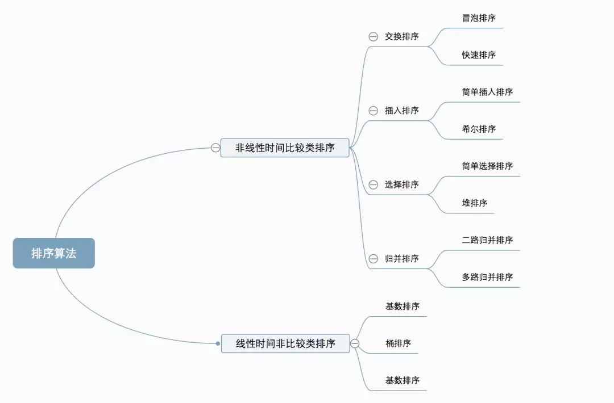
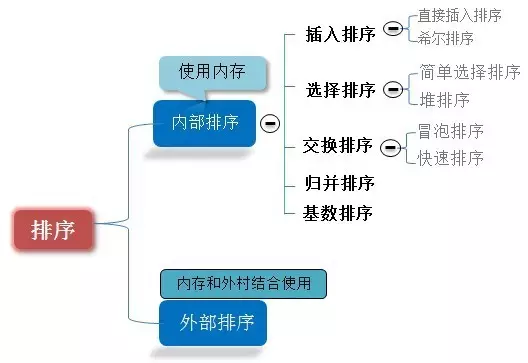
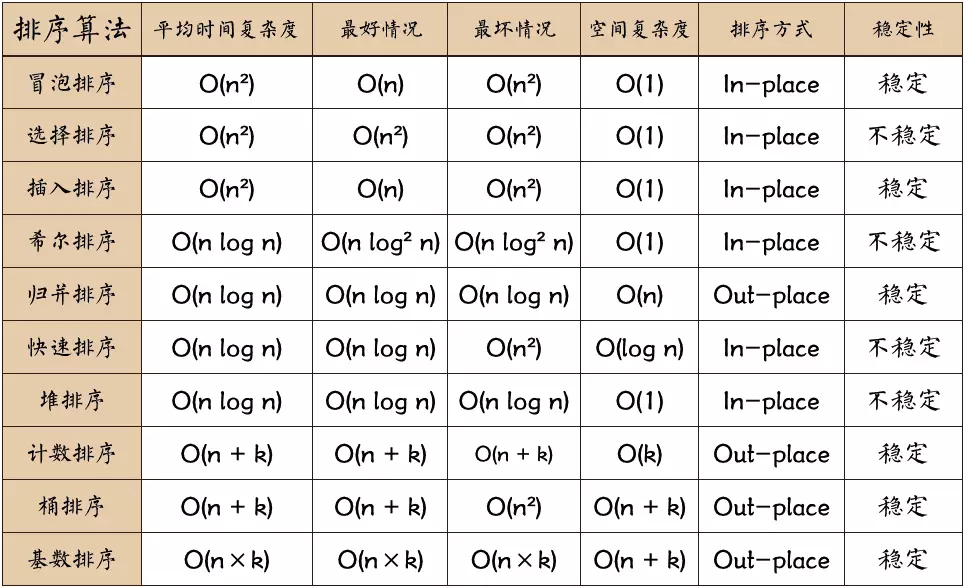
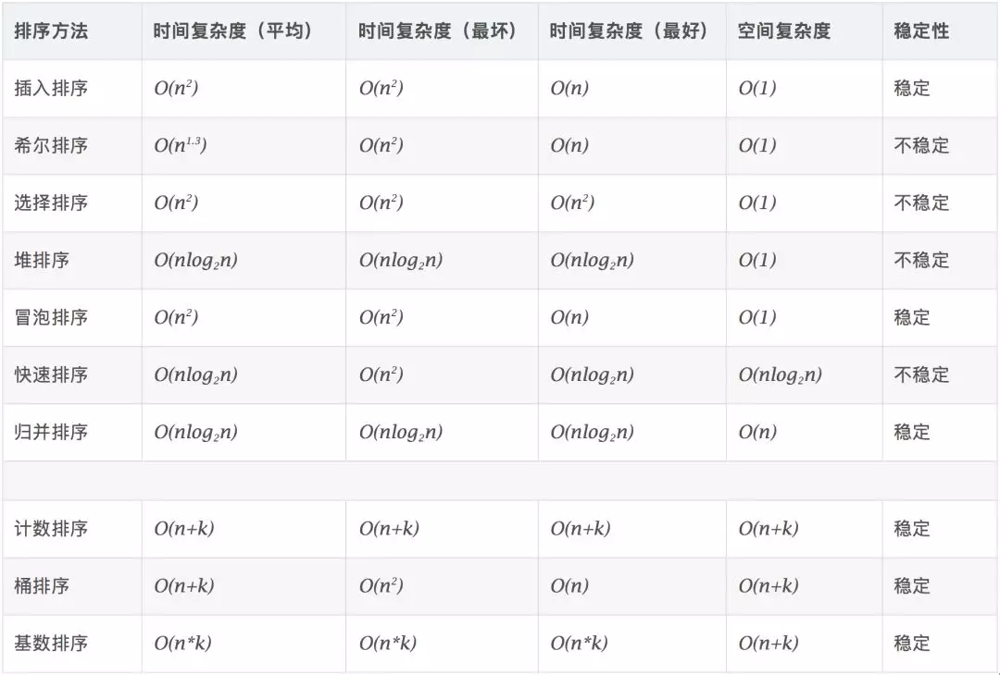
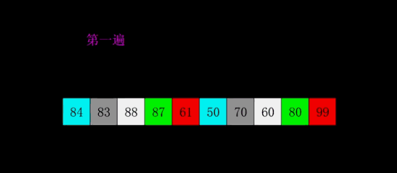

#一、算法概述

###1、算法分类
十种常见排序算法可以分为两大类：

    非线性时间比较类排序：通过比较来决定元素间的相对次序，由于其时间复杂度不能突破O(nlogn)，因此称为非线性时间比较类排序。

    线性时间非比较类排序：不通过比较来决定元素间的相对次序，它可以突破基于比较排序的时间下界，以线性时间运行，因此称为线性时间非比较类排序。






###2、算法复杂度





###3、相关概念

    稳定：如果a原本在b前面，而a=b，排序之后a仍然在b的前面。

    不稳定：如果a原本在b的前面，而a=b，排序之后 a 可能会出现在 b 的后面。

    时间复杂度：对排序数据的总的操作次数。反映当n变化时，操作次数呈现什么规律。

    空间复杂度：是指算法在计算机内执行时所需存储空间的度量，它也是数据规模n的函数。


#二、十大经典算法

##1、冒泡排序

冒泡排序是一种简单的排序算法。它重复地走访过要排序的数列，一次比较两个元素，如果它们的顺序错误就把它们交换过来。走访数列的工作是重复地进行直到没有再需要交换，也就是说该数列已经排序完成。这个算法的名字由来是因为越小的元素会经由交换慢慢“浮”到数列的顶端。

####1.1 算法描述

- 比较相邻的元素。如果第一个比第二个大，就交换它们两个；

- 对每一对相邻元素作同样的工作，从开始第一对到结尾的最后一对，这样在最后的元素应该会是最大的数；

- 针对所有的元素重复以上的步骤，除了最后一个；

- 重复步骤1~3，直到排序完成。


####1.2 动图演示


####1.3 代码实现

```java
    public static int[] bubbleSort(int[] arr) {
        int len = arr.length;
        int temp = 0;
        for (int i = 0; i < len - 1; i++) {
            for (int j = 0; j < len - 1 - i; j++) {
                if(arr[j] > arr[j+1]) {
                    temp = arr[j+1];
                    arr[j+1] = arr[j];
                    arr[j] = temp;
                }
            }
        }
        return arr;
    }
```

##2、选择排序（Selection Sort） 

选择排序(Selection-sort)是一种简单直观的排序算法。它的工作原理：首先在未排序序列中找到最小（大）元素，存放到排序序列的起始位置，然后，再从剩余未排序元素中继续寻找最小（大）元素，然后放到已排序序列的末尾。以此类推，直到所有元素均排序完毕。

####2.1 算法描述

n个记录的直接选择排序可经过n-1趟直接选择排序得到有序结果。具体算法描述如下：

- 初始状态：无序区为R[1..n]，有序区为空；

- 第i趟排序(i=1,2,3…n-1)开始时，当前有序区和无序区分别为R[1..i-1]和R(i..n）。该趟排序从当前无序区中-选出关键字最小的记录 R[k]，将它与无序区的第1个记录R交换，使R[1..i]和R[i+1..n)分别变为记录个数增加1个的新有序区和记录个数减少1个的新无序区；

- n-1趟结束，数组有序化了。

####2.2 动图演示


####2.3 代码实现

```java
    public static int[] selectionSort(int[] arr) {
        int len = arr.length;
        int temp = 0;
        int minIndex = 0;
        for (int i = 0; i < len - 1; i++) {
            minIndex = i;
            for (int j = i+1; j < len; j++) {
                if(arr[j] < arr[minIndex]) {// 寻找最小的数
                    minIndex = j;// 将最小数的索引保存
                }
            }
            temp = arr[minIndex];
            arr[minIndex] = arr[i];
            arr[i] = temp;
        }
        return arr;
    }
```

####2.4 算法分析

表现最稳定的排序算法之一，因为无论什么数据进去都是O(n2)的时间复杂度，所以用到它的时候，数据规模越小越好。唯一的好处可能就是不占用额外的内存空间了吧。理论上讲，选择排序可能也是平时排序一般人想到的最多的排序方法了吧。

##3、插入排序（Insertion Sort） 

插入排序（Insertion-Sort）的算法描述是一种简单直观的排序算法。它的工作原理是通过构建有序序列，对于未排序数据，在已排序序列中从后向前扫描，找到相应位置并插入。

####3.1 算法描述

一般来说，插入排序都采用in-place在数组上实现。具体算法描述如下：

- 从第一个元素开始，该元素可以认为已经被排序；

- 取出下一个元素，在已经排序的元素序列中从后向前扫描；

- 如果该元素（已排序）大于新元素，将该元素移到下一位置；

- 重复步骤3，直到找到已排序的元素小于或者等于新元素的位置；

- 将新元素插入到该位置后；

- 重复步骤2~5。

####3.2 动图演示


####3.2 代码实现

```java
    public static int[] selectionSort(int[] arr) {
        int len = arr.length;
        int current = 0;
        int preIndex = 0;
        for (int i = 1; i < len; i++) {
            preIndex = i - 1;
            current = arr[i];
            while (preIndex >= 0 && arr[preIndex] > current) {
                arr[preIndex + 1] = arr[preIndex];
                preIndex--;
            }
            arr[preIndex + 1] = current;
        }
        return arr;
    }
```

####3.3 算法分析

插入排序在实现上，通常采用in-place排序（即只需用到O(1)的额外空间的排序），因而在从后向前扫描过程中，需要反复把已排序元素逐步向后挪位，为最新元素提供插入空间。


##4、希尔排序（Shell Sort） 

1959年Shell发明，第一个突破O(n2)的排序算法，是简单插入排序的改进版。它与插入排序的不同之处在于，它会优先比较距离较远的元素。希尔排序又叫缩小增量排序。

####4.1 算法描述

先将整个待排序的记录序列分割成为若干子序列分别进行直接插入排序，具体算法描述：

- 选择一个增量序列t1，t2，…，tk，其中ti>tj，tk=1；

- 按增量序列个数k，对序列进行k 趟排序；

- 每趟排序，根据对应的增量ti，将待排序列分割成若干长度为m 的子序列，分别对各子表进行直接插入排序。仅增量因子为1 时，整个序列作为一个表来处理，表长度即为整个序列的长度。

####4.2 动图演示



####4.3 代码实现

```java
    public static int[] shellSort(int[] arr) {
        int len = arr.length;
        int gap = 1;
        int temp;
        while (gap < len) { // 动态定义间隔序列
            gap = gap * 3 + 1;
        }
        int j;
        while (gap > 0) {
            for (int i = gap; i < len; i++) {
                temp = arr[i];
                for (j = i - gap; j >= 0 && arr[j] > temp; j -= gap) {
                    arr[j + gap] = arr[j];
                }
                arr[j + gap] = temp;
            }
            gap = (int) Math.floor(gap / 3);
        }
        return arr;
    
```

####4.4 算法分析

希尔排序的核心在于间隔序列的设定。既可以提前设定好间隔序列，也可以动态的定义间隔序列。动态定义间隔序列的算法是《算法（第4版）》的合著者Robert Sedgewick提出的。


