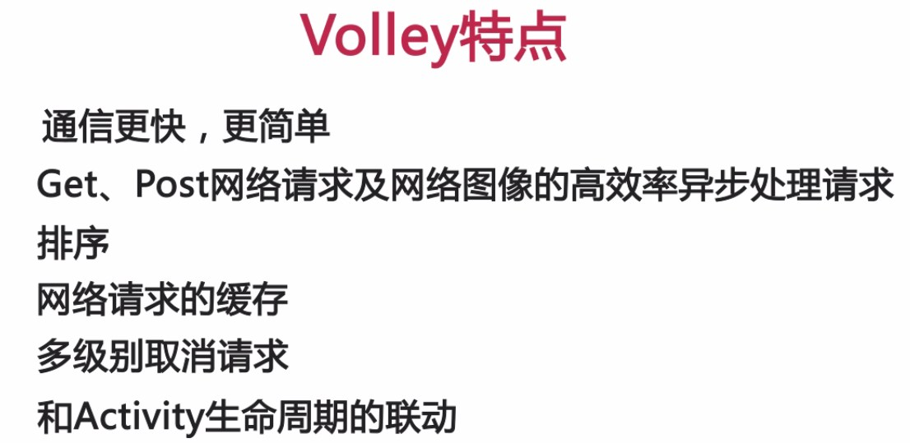
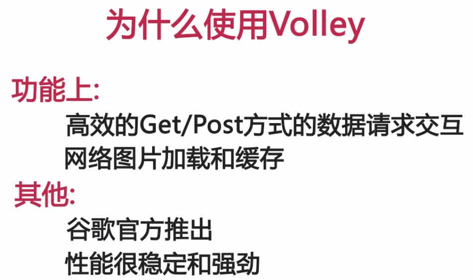
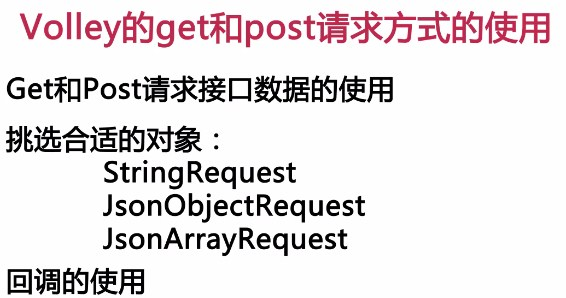
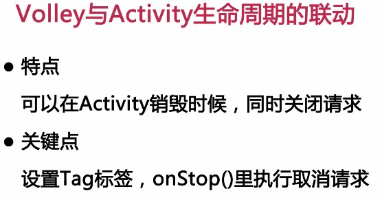

1、Android开发团队也是意识到了有必要将 HTTP的通信操作再进行简单化，于是在2013年GoogleI/O大会上 推出了一个新的网络通信框架——Volley。Volley可是说是把AsyncHttpClient和 Universal-Image-Loader的优点集于了一身 ，既可以像AsyncHttpClient一样非常简单地进行 HTTP通信 ，也可以像 Universal-Image-Loader一样轻松加载网络上的图片。除了简单易用之外，Volley在性能方面也进行了大幅度的调整，它的设计目标就是非常适合去进行数据量不大 ，但通信频繁的网络操作 ；而对于大数据量的网络操作 ，比如说下载文件等 ，Volley的表现就会非常糟糕。 

1、Request 类中包含了请求 url，请求请求方式，请求 Header，请求 Body，请求的优先级等信息。
因为是抽象类，子类必须重写的两个方法。
abstract protected Response<T> parseNetworkResponse(NetworkResponse response);
子类重写此方法，将网络返回的原生字节内容，转换成合适的类型。此方法会在工作线程中被调用。
abstract protected void deliverResponse(T response);
子类重写此方法，将解析成合适类型的内容传递给它们的监听回调。

