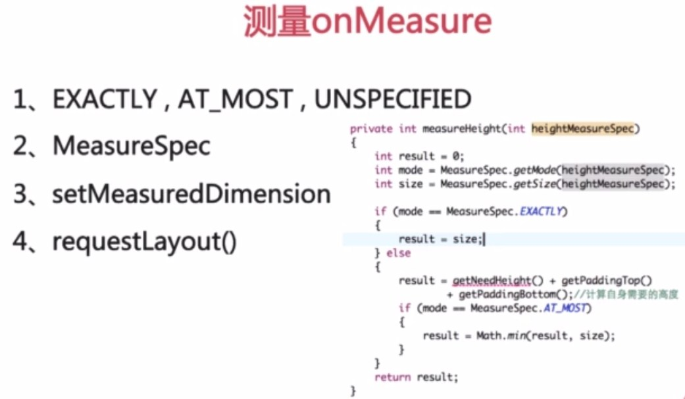
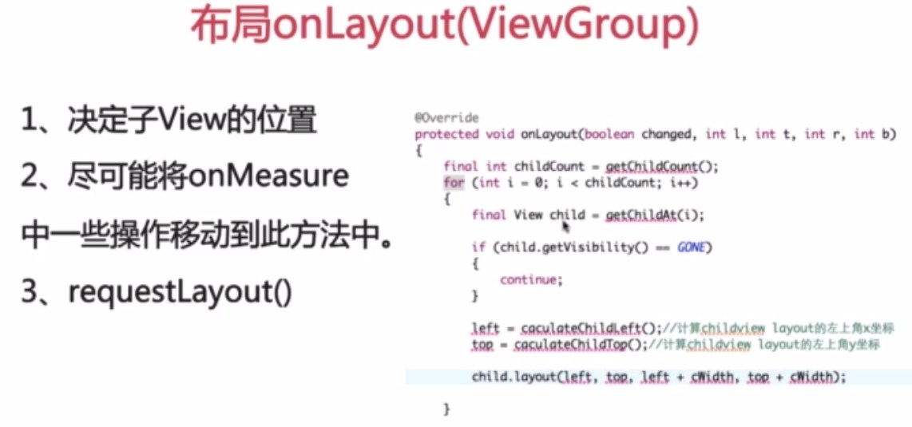
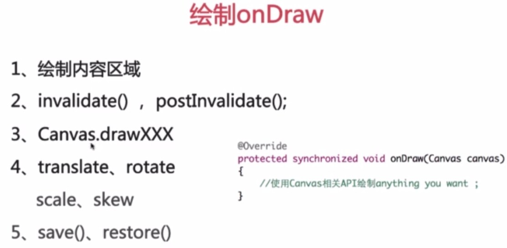
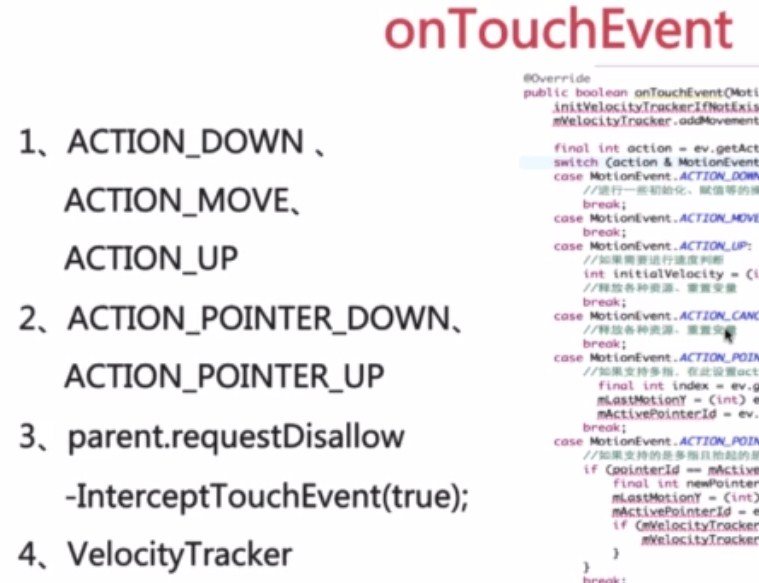
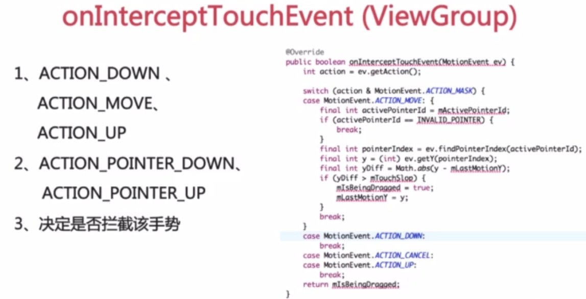

一、如何自定义控件
1、自定义属性的声明与获取
2、测量onMeasure
3、布局onLayout(ViewGroup)
4、绘制onDraw
5、onTouchEvent
6、onInterceptTouchEvent(ViewGroup)
二、自定义属性声明与获取
1、分析需要的自定义属性
2、在res/values/attrs.xml定义声明
3、在layout.xml文件中进行使用
4、在View的构造方法中进行获取

