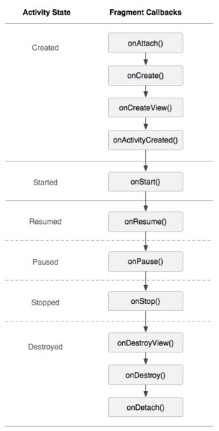

##Fragment的生命周期
Fragment必须是依存与Activity而存在的，因此Activity的生命周期会直接影响到Fragment的生命周期。官网这张图很好的说明了两者生命周期的关系：

可以看到Fragment比Activity多了几个额外的生命周期回调方法：
    onAttach(Activity)

当Fragment与Activity发生关联时调用。
    onCreateView(LayoutInflater, ViewGroup,Bundle)

创建该Fragment的视图
    onActivityCreated(Bundle)

当Activity的onCreate方法返回时调用
    onDestoryView()

与onCreateView想对应，当该Fragment的视图被移除时调用
    onDetach()

与onAttach相对应，当Fragment与Activity关联被取消时调用
注意：除了onCreateView，其他的所有方法如果你重写了，必须调用父类对于该方法的实现，

##5、Fragment家族常用的API
Fragment常用的三个类：

- android.app.Fragment 主要用于定义Fragment
- android.app.FragmentManager 主要用于在Activity中操作Fragment
- android.app.FragmentTransaction 保证一些列Fragment操作的原子性，熟悉事务这个词，一定能明白

####a、获取FragmentManage的方式：
getFragmentManager() // v4中，getSupportFragmentManager

####b、主要的操作都是FragmentTransaction的方法
FragmentTransaction transaction = fm.benginTransatcion();//开启一个事务

transaction.add() 往Activity中添加一个Fragment

transaction.remove() 
从Activity中移除一个Fragment，如果被移除的Fragment没有添加到回退栈（回退栈后面会详细说），这个Fragment实例将会被销毁。

transaction.replace()
使用另一个Fragment替换当前的，实际上就是remove()然后add()的合体

transaction.hide()
隐藏当前的Fragment，仅仅是设为不可见，并不会销毁

transaction.show()显示之前隐藏的Fragment

detach()
会将view从UI中移除,和remove()不同,此时fragment的状态依然由FragmentManager维护。

attach()重建view视图，附加到UI上并显示。

transatcion.commit()//提交一个事务

注意：常用Fragment的哥们，可能会经常遇到这样Activity状态不一致：State loss这样的错误。主要是因为：commit方法一定要在Activity.onSaveInstance()之前调用。

上述，基本是操作Fragment的所有的方式了，在一个事务开启到提交可以进行多个的添加、移除、替换等操作。

值得注意的是：如果你喜欢使用Fragment，一定要清楚这些方法，哪个会销毁视图，哪个会销毁实例，哪个仅仅只是隐藏，这样才能更好的使用它们。

- a、比如：我在FragmentA中的EditText填了一些数据，当切换到FragmentB时，如果希望会到A还能看到数据，则适合你的就是hide和show；也就是说，希望保留用户操作的面板，你可以使用hide和show，当然了不要使劲在那new实例，进行下非null判断。
- b、再比如：我不希望保留用户操作，你可以使用remove()，然后add()；或者使用replace(),这个和remove,add是相同的效果。
- c、remove和detach有一点细微的区别，在不考虑回退栈的情况下，remove会销毁整个Fragment实例，而detach则只是销毁其视图结构，实例并不会被销毁。那么二者怎么取舍使用呢？如果你的当前Activity一直存在，那么在不希望保留用户操作的时候，你可以优先使用detach。

## Fragment与Activity通信
因为所有的Fragment都是依附于Activity的，所以通信起来并不复杂，大概归纳为：

- a、如果你Activity中包含自己管理的Fragment的引用，可以通过引用直接访问所有的Fragment的public方法
- b、如果Activity中未保存任何Fragment的引用，那么没关系，每个Fragment都有一个唯一的TAG或者ID,可以通过getFragmentManager.findFragmentByTag()或者findFragmentById()获得任何Fragment实例，然后进行操作。
- c、在Fragment中可以通过getActivity得到当前绑定的Activity的实例，然后进行操作。
注：如果在Fragment中需要Context，可以通过调用getActivity(),如果该Context需要在Activity被销毁后还存在，则使用getActivity().getApplicationContext()。
