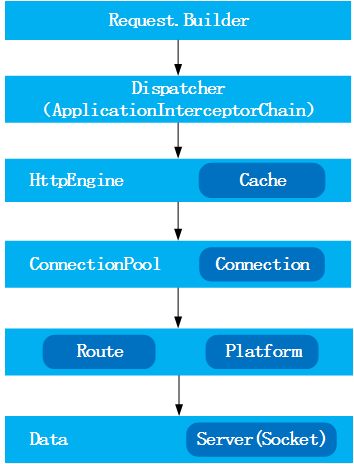
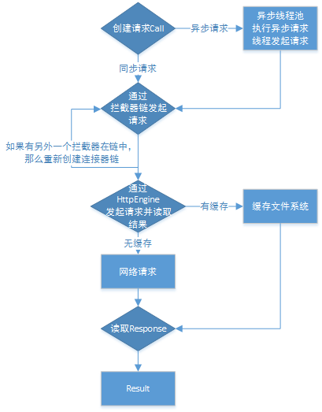
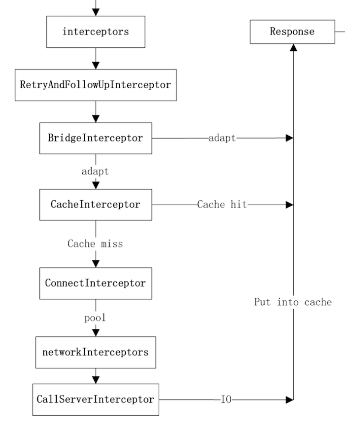

##一、总体设计



上面是OKHttp总体设计图，主要是通过Diapatcher不断从RequestQueue中取出请求（Call），根据是否已缓存调用Cache或Network这两类数据获取接口之一，从内存缓存或是服务器取得请求的数据。OKHttp有同步和异步请求，同步请求通过Call.execute()直接返回当前的Response，而异步请求会把当前的请求Call.enqueue添加（AsyncCall）到请求队列中，并通过回调（Callback）的方式来获取最后结果。


##二、请求流程图




###同步与异步的实现
在发起请求时，整个框架主要通过Call来封装每一次的请求。同时Call持有OkHttpClient和一份HttpEngine。而每一次的同步或者异步请求都会有Dispatcher的参与，不同的是：

- 同步

Dispatcher会在同步执行任务队列中记录当前被执行过的任务Call，同时在当前线程中去执行Call的getResponseWithInterceptorChain()方法，直接获取当前的返回数据Response；

- 异步

首先来说一下Dispatcher，Dispatcher内部实现了懒加载无边界限制的线程池方式，同时该线程池采用了SynchronousQueue这种阻塞队列。SynchronousQueue每个插入操作必须等待另一个线程的移除操作，同样任何一个移除操作都等待另一个线程的插入操作。因此此队列内部其 实没有任何一个元素，或者说容量是0，严格说并不是一种容器。由于队列没有容量，因此不能调用peek操作，因为只有移除元素时才有元素。显然这是一种快速传递元素的方式，也就是说在这种情况下元素总是以最快的方式从插入者（生产者）传递给移除者（消费者），这在多任务队列中是最快处理任务的方式。对于高频繁请求的场景，无疑是最适合的。
异步执行是通过Call.enqueue(Callback responseCallback)来执行，在Dispatcher中添加一个封装了Callback的Call的匿名内部类Runnable来执行当前的Call。这里一定要注意的地方这个AsyncCall是Call的匿名内部类。AsyncCall的execute方法仍然会回调到Call的getResponseWithInterceptorChain方法来完成请求，同时将返回数据或者状态通过Callback来完成。

##三、拦截器的作用。

先来看看Interceptor本身的文档解释：观察，修改以及可能短路的请求输出和响应请求的回来。**通常情况下拦截器用来添加，移除或者转换请求或者回应的头部信息**。拦截器接口中有intercept(Chain chain)方法，同时返回Response。

真正发出网络请求，解析返回结果的，还是 getResponseWithInterceptorChain：

```java
private Response getResponseWithInterceptorChain() throws IOException {
  // Build a full stack of interceptors.
  List<Interceptor> interceptors = new ArrayList<>();
  interceptors.addAll(client.interceptors());
  interceptors.add(retryAndFollowUpInterceptor);
  interceptors.add(new BridgeInterceptor(client.cookieJar()));
  interceptors.add(new CacheInterceptor(client.internalCache()));
  interceptors.add(new ConnectInterceptor(client));
  if (!retryAndFollowUpInterceptor.isForWebSocket()) {
    interceptors.addAll(client.networkInterceptors());
  }
  interceptors.add(new CallServerInterceptor(
      retryAndFollowUpInterceptor.isForWebSocket()));
​
​
  Interceptor.Chain chain = new RealInterceptorChain(
      interceptors, null, null, null, 0, originalRequest);
  return chain.proceed(originalRequest);
}
```

可见 Interceptor 是 OkHttp 最核心的一个东西，不要误以为它只负责拦截请求进行一些额外的处理（例如 cookie），**实际上它把实际的网络请求、缓存、透明压缩等功能都统一了起来，每一个功能都只是一个 Interceptor，它们再连接成一个 Interceptor.Chain，环环相扣，最终圆满完成一次网络请求。**


从 getResponseWithInterceptorChain 函数我们可以看到，Interceptor.Chain 的分布依次是：





1、在配置 OkHttpClient 时设置的 interceptors；

2、负责失败重试以及重定向的 RetryAndFollowUpInterceptor；

3、负责把用户构造的请求转换为发送到服务器的请求、把服务器返回的响应转换为用户友好的响应的 BridgeInterceptor；

4、负责读取缓存直接返回、更新缓存的 CacheInterceptor；

5、负责和服务器建立连接的 ConnectInterceptor；

6、配置 OkHttpClient 时设置的 networkInterceptors；

7、负责向服务器发送请求数据、从服务器读取响应数据的 CallServerInterceptor。

在这里，位置决定了功能，最后一个 Interceptor 一定是负责和服务器实际通讯的，重定向、缓存等一定是在实际通讯之前的。


总结：

1、OkHttpClient 实现 Call.Factory，负责为 Request 创建 Call；

2、RealCall 为具体的 Call 实现，其 enqueue() 异步接口通过 Dispatcher 利用 ExecutorService 实现，而最终进行网络请求时和同步 execute() 接口一致，都是通过 getResponseWithInterceptorChain() 函数实现；

3、getResponseWithInterceptorChain() 中利用 Interceptor 链条，分层实现缓存、透明压缩、网络 IO 等功能；


http://frodoking.github.io/2015/03/12/android-okhttp/ 

https://blog.piasy.com/2016/07/11/Understand-OkHttp/

http://www.jianshu.com/p/27c1554b7fee