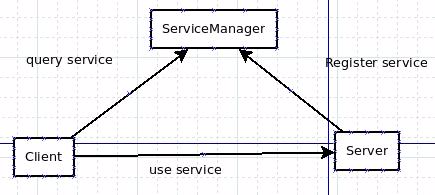
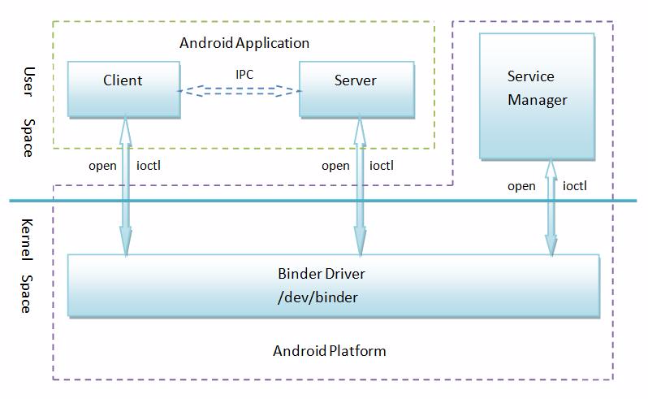
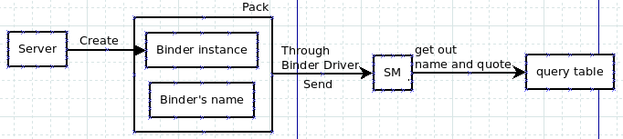
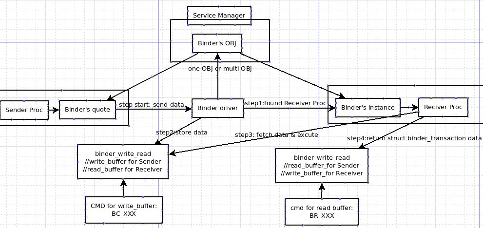
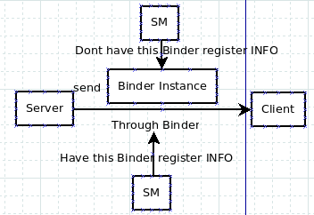

##1、android与linux通讯机制的比较。
   
在linux中使用的IPC通讯机制如下：pipe,signal,trace，共享内存，信号灯，消息队列，socket。

而在Android中，并没有使用这些，取而代之的是Binder机制。Binder机制是采用OpenBinder演化而来，在Android中使用它的原因如下：

- 1.采用C/S的通信模式。而在linux通信机制中，目前只有socket支持C/S的通信模式，但socket有其劣势，具体参看第二条。

- 2.有更好的传输性能。对比于Linux的通信机制，

>socket：是一个通用接口，导致其传输效率低，开销大；

>管道和消息队列：因为采用存储转发方式，所以至少需要拷贝2次数据，效率低；

>共享内存：虽然在传输时没有拷贝数据，但其控制机制复杂（比如跨进程通信时，需获取对方进程的pid，得多种机制协同操作）。

- 3.安全性更高。Linux的IPC机制在本身的实现中，并没有安全措施，得依赖上层协议来进行安全控制。而Binder机制的 UID/PID是由Binder机制本身在内核空间添加身份标识，安全性高；并且Binder可以建立私有通道，这是linux的通信机制所无法实现的 （Linux访问的接入点是开放的）。

综上所述，Android采用Binder机制是有道理的。既然Binder机制这么多优点，那么我们接下来看看它是怎样通过C/S模型来实现的。

##2 、Binder在Service服务中的作用

在android中，有很多Service都是通过binder来通信的,比如MediaServer旗下包含了众多service：

    AudioFlinger 音频核心服务

    AudioPolicyService：音频策略相关的重要服务

    MediaPlayerService：多媒体系统中的重要服务

    CameraService：有关摄像/照相的重要服务

Binder在C/S中的流程如下：

1、Server注册服务。Server作为众多Service的拥有者，当它想向Client提供服务时，得先去Service Manager（以后缩写成SM）那儿注册自己的服务。Server可以向SM注册一个或多个服务。

2、Client申请服务。Client作为Service的使用者，当它想使用服务时，得向SM申请自己所需要的服务。Client可以申请一个或多个服务。

3、当Client申请服务成功后，Client就可以使用服务了。

SM一方面管理Server所提供的服务，同时又响应Client的请求并为之分配相应的服务。扮演的角色相当于月老，两边牵线。这种通信方式的好处是： 一方面，service和Client请求便于管理，另一方面在应用程序开发时，只需为Client建立到Server的连接，就可花很少时间和精力去实 现Server相应功能。那么，Binder与这个通信模式有什么关系呢？！其实，3者的通信方式就是Binder机制（例如：Server向SM注册服 务，使用Binder通信；Client申请请求，用的是Binder通讯）

##3、Binder通讯机制流程（整体框架）

上图即是Binder的通信模型。我们可以发现：

    1.Client和Server是存在于用户空间

    2.Client与Server通信的实现，是由Binder驱动在内核空间实现

    3.SM作为守护进程，处理客户端请求，管理所有服务项。

为了方便理解，我们可以把SM理解成DNS服务器; 那么Binder Driver 就相当于路由的功能。这里就涉及到Client和Server是如何通信的问题。下面对2中提到的3个流程进行说明。

###3.1、Server向SM注册服务

    1.首先，XXXServer(XXX代表某个)在自己的进程中向Binder驱动申请创建一个XXXService的Binder的实体，

    2.Binder驱动为这个XXXService创建位于内核中的Binder实体节点以及Binder的引用，注意，是将名字和新建的引用打包传递给SM（实体没有传给SM），通知SM注册一个名叫XXX的Service。

    3.SM收到数据包后，从中取出XXXService名字和引用，填入一张查找表中。

    4.此时，如果有Client向SM发送申请服务XXXService的请求，那么SM就可以在查找表中找到该Service的Binder引用，并把Binder引用(XXXBpBinder)返回给Client。

在进一步了解Binder通信机制之前，我们先弄清几个概念。

    1.引用和实体。这里，对于一个用于通信的实体（可以理解成具有真实空间的Object），可以有多个该实体的引用（没有真实空间，可以理解成实体的 一个链接，操作引用就会操作对应链接上的实体）。如果一个进程持有某个实体，其他进程也想操作该实体，最高效的做法是去获得该实体的引用，再去操作这个引 用。

    2.有些资料把实体称为本地对象，引用成为远程对象。可以这么理解：引用是从本地进程发送给其他进程来操作实体之用，所以有本地和远程对象之名。

###3.2、一个问题--如何获得SM的远程接口

如果你足够细心，会发现这里有一个问题：

Sm和Server都是进程，Server向SM注册Binder需要进程间通信，当前实现的是进程间通信却又用到进程间通信。这就好比鸡生蛋、蛋生鸡，但至少得先有其中之一。

**巧妙的Binder解决思路:**

针对Binder的通信机制，Server端拥有的是Binder的实体；Client端拥有的是Binder的引用。如果把SM看作Server端，让它在Binder驱动一运行起来时就有自己的Binder实体（代码中设置ServiceManager的Binder 其handle值恒为0）。这个Binder实体没有名字也不需要注册，所有的client都认为handle值为0的binder引用是用来与SM通信 的（代码中是这么实现的），那么这个问题就解决了。那么，Client和Server中这么达成协议了（handle值为0的引用是专门与SM通信之用 的），还不行，还需要让SM有handle值为0的实体才算大功告成。怎么实现的呢？！当一个进程调用Binder驱动时，使用 BINDER_SET_CONTEXT_MGR命令（在驱动的binder_ioctl中）将自己注册成SM时，Binder驱动会自动为它创建 Binder实体。这个Binder的引用对所有的Client都为0。

###3.3、Client从SM获得Service的远程接口

Server向SM注册了Binder实体及其名字后，Client就可以通过Service的名字在SM的查找表中获得该Binder的引用了 （BpBinder）。Client也利用保留的handle值为0的引用向SM请求访问某个Service：我申请访问XXXService的引用。 SM就会从请求数据包中获得XXXService的名字，在查找表中找到该名字对应的条目，取出Binder的引用打包回复给client。之 后，Client就可以利用XXXService的引用使用XXXService的服务了。

如果有更多的Client请求该Service，系统中就会有更多的Client获得这个引用。

###3.4、建立C/S通路后

首先要理清一个概念：client拥有自己Binder的实体，以及Server的Binder的引用；Server拥有自己Binder的实体，以及Client的Binder的引用。我们也可以从接收方和发送方的方式来理解：

    1.从client向Server发数据：Client为发送方，拥有Binder的实体；Server为接收方，拥有Binder的引用

    2.从server向client发数据：Server为发送方，拥有Binder的实体；client为接收方，拥有Binder的引用。

也就是说，我们在建立了C/S通路后，无需考虑谁是Client谁是Server，只要理清谁是发送方谁是接收方，就能知道Binder的实体和引用在哪边。

建立CS通路后的流程：（当接收方获得Binder的实体，发送方获得Binder的引用后）

    1.发送方会通过Binder实体请求发送操作。

    2.Binder驱动会处理这个操作请求,把发送方的数据放入写缓存(binder_write_read.write_buffer) (对于接收方为读缓冲区)，并把read_size(接收方读数据)置为数据大小（对于具体的实现后面会介绍）；

    3.接收方之前一直在阻塞状态中，当写缓存中有数据，则会读取数据，执行命令操作

    4.接收方执行完后，会把返回结果同样用binder_transaction_data结构体封装，写入写缓冲区（对于发送方，为读缓冲区）

###3.5、匿名Binder

之前在介绍Android使用Binder机制的优点中，提到Binder可以建立点对点的私有通道，匿名Binder就是这种方式。在 Binder通信中，并不是所有用来通信的Binder实体都需要注册给SM广而告之的，Server可以通过已建立的实体Binder连接将创建的 Binder实体传给Client。而这个Binder没有向SM注册名字。这样Server与Client的通信就有很高的隐私性和安全性。

