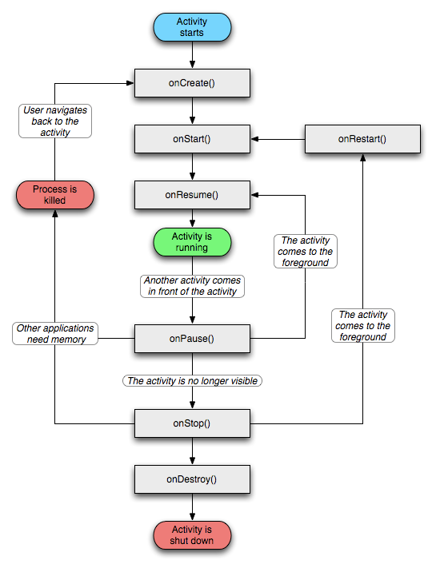

一、activity生命周期

###1、onStart()与onResume()的区别？
onStart()是activity界面被显示出来的时候执行的，用户可见，包括有一个activity在他上面，但没有将它完全覆盖，用户可以看到部分activity但不能与它交互。
onResume()是当该activity与用户能进行交互时被执行，用户可以获得activity的焦点，能够与用户交互。

onStart()通常就是onStop()（也就是用户按下了home键，activity变为后台后），之后用户再切换回这个activity就会调用onRestart()而后调用onStart()
onResume()是onPause()（通常是当前的acitivty被暂停了，比如被另一个透明或者Dialog样式的Activity覆盖了），之后dialog取消，activity回到可交互状态，调用onResume()。

###2、从AActivity切换到BActivity时，先AActivity的onPause()被调用，然后是BActivity的初始化流程（onCreate() --> onStart() --> onResume()），再然后是AActivity的onStop()被调用。为什么不是先AActivity的onPause()、onStop()被调用，然后再BActivity的初始化流程（onCreate() --> onStart() --> onResume()）？或者又为什么不是先BActivity的初始化流程（onCreate() --> onStart() --> onResume()），再AActivity的onPause()、onStop()被调用？
  
在 onResume() 的注释中，建议是在onResume()中打开独占设备（比如相机），与onResume()对应的是onPause()，关闭相机的操作也应该在此方法中被调用；否则，考虑一下如下场景：

如果AActivity打开了相机，我们点击某按钮要跳转到BActivity中，BActivity也想打开相机；假设AActivity的onPause() 在 BActivity启动后再被调用，那BActivity根本就无法再正常启动相机。

onPause() 的注释中，也明确地说了，在这个方法中执行停止动画等比较耗CPU的操作，如果不先执行这些操作，就先启动新应用，然后再来执行此操作，确实是不合逻辑；

当用户触发某事件切换到新的Activity，用户肯定是想尽快进入新的视图进行操作，上面已经说了，在onResume()一般会打开独占设备，开启动画等，当需要从AActivity切换到BActivity时，先执行AActivity中的与onResume()相对应的onPause()操作，比如关闭独占设备，关闭动画，或其它耗费cpu的操作；以防止BActivity也需要使用这些资源，关闭耗CPU的操作，也有利于BActivity运行的流畅。

AActivity中比较消耗资源的部分关闭后，再切换到BActivity中执行BActivity的初始化，显示BActivity中的View。当BActivity已经执行显示出来了，用户可以交互，后台再去执行AActivity的onStop()操作，即使这里面有些比较耗时的操作，也没有关系，这是在后台执行所以也不影响用户的体验。

###3、如果所有的初始化都在onCreate()中实现，会有什么问题？

首先，Activity的onCreate()被调用时，Activity还不可见，如果要做一些动画，既然视图还不存在，在onCreate中来启动动画，明显有问题；其次，AActivity 切换到 BActivity，再切换到 AActivity（我们假定是AActivity的同一个实例），由于实例已经存在，所以onCreate不会再被调用，那AActivity从后台切换至前台时，有可能需要一些初始化，那就没法再被调用到了，也有问题。

###4、如果所有的初始化都在onStart()中实现，会有什么问题？
首先，onCreate()注释中，是明确建议 setContentView()、findViewById() 要在 onCreate() 中被调用，但我实测了一下，在onStart()中调用 setContentView()、findViewById() 功能也是正常的；

其次，onStart() 被调用时，Activity可能是可见了，但还不是可交互的，onResume()的注释中都明确地说了这不是Activity对用户是可见的最好的指示器，onStart() 在这之前被调用，那有一些特殊的初始化相关的逻辑在这里被调用也会有问题。

###5、如果把所有的去初始化都在onStop()中实现，会有什么问题？
1、 在 onResume() 的注释中，建议是在onResume()中打开独占设备（比如相机），与onResume()对应的是onPause()，所以所有的去初始化操作放在onStop()中执行，可能会引出新的问题；

2、onStop() 的注释中明确地写了，在内存不足而导致系统无法保留此进程的情况下，onStop() 可能都不会被执行。   

###二、如何理解activity、view、window三者之间的关系？
这个问题真的很不好回答。所以这里先来个算是比较恰当的比喻来形容下它们的关系吧。Activity像一个工匠（控制单元），Window像窗户（承载模型），View像窗花（显示视图）LayoutInflater像剪刀，Xml配置像窗花图纸。

1：Activity构造的时候会初始化一个Window，准确的说是PhoneWindow。

2：这个PhoneWindow有一个“ViewRoot”，这个“ViewRoot”是一个View或者说ViewGroup，是最初始的根视图。

3：“ViewRoot”通过addView方法来一个个的添加View。比如TextView，Button等

4：这些View的事件监听，是由WindowManagerService来接受消息，并且回调Activity函数。比如onClickListener，onKeyDown等。 
   
##三、activity的launchmode

启动模式（launchMode）在多个Activity跳转的过程中扮演着重要的角色，它可以决定是否生成新的Activity实例，是否重用已存在的Activity实例，是否和其他Activity实例共用一个task。 
Activity一共有以下四种launchMode：standard、singleTop、singleTask、singleInstance。 

我们可以在AndroidManifest.xml配置<activity>的android:launchMode属性为以上四种之一即可。 
    下面我们结合实例一一介绍这四种lanchMode。 

###1、standard 

standard模式是默认的启动模式，不用为<activity>配置android:launchMode属性即可，当然也可以指定值为standard。 
   
standard模式的原理如下图所示：

每次跳转系统都会在task 中生成一个新的FirstActivity实例，并且放于栈结构的顶部，当我们按下后退键时，才能看到原来的FirstActivity实例。这就是standard启动模式，**不管有没有已存在的实例，都生成新的实例**。

###2、singleTop 

为<activity>指定属性android:launchMode="singleTop"，系统就会按照singleTop启动模式处理跳转行为。

singleTop模式的原理如下图所示：  

跳转时系统会先在栈结构中寻找是否有一个FirstActivity实例正位于栈顶，如果有则不再生成新的，而是直接使用。但是依然可以创建其他种类的Activity。 

但是当从SecondActivity跳转到FirstActivity时，系统发现存在有FirstActivity实例，但不是位于 栈顶，于是重新生成一个实例。

###3、singleTask 
在上面的基础上我们修改FirstActivity 的属性android:launchMode="singleTask"。
 
在跳转过程中系统发现有存在的FirstActivity实例，于是不再生成新的实例，**而是将FirstActivity之上的Activity实例统统出栈**，将FirstActivity变为栈顶对象，显示到屏幕前。也许大家有疑问，如果将SecondActivity也设置为singleTask模式，那么SecondActivity实例是不是可以唯一呢？在我们这个示例中是不可能的，因为每次从SecondActivity跳转到FirstActivity时，SecondActivity实例都被迫出栈，下次等FirstActivity跳转到SecondActivity时，找不到存在的SecondActivity实例，于是必须生成新的实例。但是如果我们有ThirdActivity，让SecondActivity和ThirdActivity互相跳转，那么SecondActivity实例就可以保证唯一。 

这就是singleTask模式，如果发现有对应的Activity实例，则使此Activity实例之上的其他Activity实例统统出栈，使此Activity实例成为栈顶对象，显示到屏幕前。 

一个任务栈中只能有一个FirstActivity实例，但是可以有多个其他Activity实例，当其他Activity启动在栈底的FirstActivity时，系统会将FirstActivity上面的所有Activity实例给干掉！

###4、singleInstance 

一个FirstActivity独享一个任务栈，不允许其他Activity进来。

这种启动模式比较特殊，因为它会启用一个新的栈结构，将Activity放置于这个新的栈结构中，并保证不再有其他Activity实例进入。 

我们修改FirstActivity 的launchMode="standard"，SecondActivity 的launchMode="singleInstance"，我们看到从FirstActivity跳转到SecondActivity时，重新启用了一个新的栈结构来放置SecondActivity实例，然后按下后退键，再次回到原始栈结构，这个时候系统会在原始栈结构中生成一个FirstActivity实例，然后回退两次，注意，并没有退出，而是回到了SecondActivity，为什么呢？是因为从SecondActivity跳转到FirstActivity 的时候，我们的起点变成了SecondActivity实例所在的栈结构，这样一来，我们需要 “回归”到这个栈结构。

